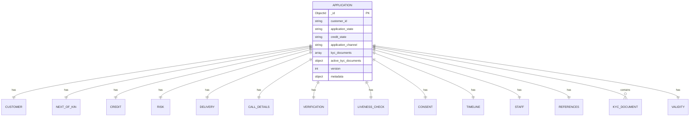

# Complete Airtable to Database Migration Documentation

## Overview

This document provides a comprehensive mapping between Airtable tables, Entity Relationship Diagrams (ERD), and the target PostgreSQL and MongoDB database schemas for the MoReach platform migration. It includes both high-level architectural mappings and detailed field-by-field transformations.

## Database Architecture Strategy

### PostgreSQL (Structured Data)
- **Users & Organizations**: User management, roles, permissions
- **Customers Management**: Customer records, wallets, transactions, blacklist
- **Customer Experience**: Reviews and feedback
- **Sales (Loan Engine)**: Sales, sales state, sale overrides
- **Inventory Management**: Products, price plans, inventory, SKUs, repairs
- **Orders and Delivery**: Order processing and delivery tracking

### MongoDB (Unstructured Data)
- **Applications**: Lead and prospect management with complex nested structures
- **Verification Transactions**: Phone verification, identity verification, liveness checks
- **Analysis**: Mobile money analysis, credit bureau data
- **Validation Records**: Complex validation workflows
- **Notifications**: Notification logs and management

---

# PART I: HIGH-LEVEL ERD MAPPINGS

## 1. Applications Module (MongoDB)

### Source Airtable Tables:
- **External Leads** (`External Leads.csv`)
- **Prospects** (via mapping functions)

### MongoDB Collection: `applications`



### High-Level Field Mappings:

**From External Leads to Application:**
```typescript
{
  PhoneNumber: personal_info.phone_primary,
  Email: personal_info.email,
  CustomerID: identification.number,
  FullName: personal_info.full_name,
  utm_source: consent.source_of_information,
  Mode_of_payment: product.purchase_mode,
  Employment_status: employment.status,
  PreferredBuyingDate: timeline.device_needed,
  Agent_ID: staff.sales_agent.dsr_id,
  Submitting_Agent_Id: staff.submitting_agent.dsr_id
}
```

**From Prospects to Application:**
```typescript
{
  Phone: personal_info.phone_primary,
  CustomerID: identification.number,
  FirstName: personal_info.first_name,
  OtherNames: personal_info.other_name,
  ProductChoice: credit.product_id,
  SalesPerson: staff.sales_agent.dsr_id,
  Email: personal_info.email,
  CustomerLocation: location.county,
  BuyingOn: product.purchase_mode,
  KINFullNames: next_of_kin.full_name,
  KINRegisteredPhone: next_of_kin.phone_primary,
  // ... additional 50+ mapped fields
}
```

---

## 2. Phone Verification Transactions (MongoDB)

### MongoDB Collection: `phone_verification_transactions`


---

## 3. Mobile Money Analysis (MongoDB)

### Source Airtable Table:
- **MoReach Spin Data** (`MoReach Spin Data.csv`)

### MongoDB Collection: `money_statement_analysis`


### Airtable Mapping:
```typescript
{
  Name: data.name,
  CustomerId: application.customer.identification.number,
  PhoneNumber: data.phone_number,
  Email: data.email,
  Duration: data.duration,
  StatementPeriod: data.statement_period,
  AgentDeposit: data.agent_deposit,
  AirtimeHighest: data.airtime_highest,
  // ... 20+ additional financial metrics
  Affordability: data.affordability,
  AverageIncome: data.average_income,
  sourceDB: 'underwriting'
}
```

---

## 4. Credit Bureau Transactions (MongoDB)

### Source Airtable Tables:
- **Transunion Data** (`Transunion Data Grid View.csv`)
- **Metropol Data** (`Metropol Data Grid.csv`)

### MongoDB Collection: `credit_bureau_transactions`


---

## 5. Call Disposition (MongoDB)

### Source Airtable Table:
- **Telesales Calls** (`Telesales Calls from MoReach.csv`)

### MongoDB Collection: `call_disposition`


### Airtable Mapping:
```typescript
{
  'External Lead': [application.recID],
  'Call Disposition': callDisposition.disposition,
  Notes: callDisposition.notes,
  'Next Call Date': callDisposition.next_call_date,
  CALLER_ID: application.staff.submitting_agent.dsr_id,
  Priority: callDisposition.priority
}
```

---

## 6. Customers Management (PostgreSQL)

### Source Airtable Table:
- **Customers Table** (`Customers Table.csv`)

### PostgreSQL Table: `customers`

```sql
CREATE TABLE customers (
    customer_id UUID PRIMARY KEY NOT NULL,
    application_id VARCHAR(255) NULL,
    customer_first_name VARCHAR(255) NOT NULL,
    customer_middle_name VARCHAR(255) NULL,
    customer_surname_name VARCHAR(255) NULL,
    customer_phone_number VARCHAR(20) UNIQUE NOT NULL,
    customer_national_id_number VARCHAR(255) UNIQUE NULL,
    customer_gender ENUM('male', 'female', 'other') NULL,
    customer_email_address VARCHAR(255) NULL,
    customer_secondary_phone VARCHAR(20) NULL,
    customer_source VARCHAR(50) NULL, -- 'airtable', 'other platform'
    customer_source_id VARCHAR(50) NULL, -- recId
    customer_status ENUM('active', 'suspended', 'closed') NOT NULL,
    selfie_url VARCHAR(500) NULL,
    id_front_url VARCHAR(500) NULL,
    id_back_url VARCHAR(500) NULL,
    referral_code VARCHAR(500) NULL,
    associated_phone_numbers TEXT[] NULL,
    customer_created_at TIMESTAMP NOT NULL DEFAULT NOW(),
    customer_updated_at TIMESTAMP NOT NULL DEFAULT NOW()
);
```

---

## 7. Blacklist/Risk Management (PostgreSQL)

### Source Airtable Table:
- **Primary Customer Data** (`Primary Customer Data.csv`)

### PostgreSQL Table: `blacklist`

```sql
CREATE TABLE blacklist (
    id UUID PRIMARY KEY,
    block_type ENUM('id_number', 'phone_number', 'imei', 'customer_id') NOT NULL,
    blocked_value VARCHAR(255) NOT NULL,
    customer_id UUID NULL REFERENCES customers(customer_id),
    phone_numbers TEXT[] NULL,
    associated_phone_numbers JSONB NULL,
    reason ENUM('fraud', 'default', 'duplicate', 'stolen_device', 'court_order', 'multiple_defaults', 'other') NOT NULL,
    description TEXT NULL,
    severity ENUM('temporary', 'permanent') NOT NULL,
    block_new_customers BOOLEAN DEFAULT TRUE,
    block_new_applications BOOLEAN DEFAULT TRUE,
    block_existing_sales BOOLEAN DEFAULT FALSE,
    is_active BOOLEAN DEFAULT TRUE,
    expires_at DATE NULL,
    created_by UUID NOT NULL,
    removed_by UUID NULL,
    removed_at TIMESTAMP NULL,
    removal_reason VARCHAR(255) NULL,
    created_at TIMESTAMP NOT NULL DEFAULT NOW(),
    updated_at TIMESTAMP NOT NULL DEFAULT NOW()
);
```

---

## 8. Customer Wallets (PostgreSQL)

### New Feature - No Direct Airtable Equivalent

### PostgreSQL Tables:

```sql
-- Customer Wallets
CREATE TABLE customer_wallets (
    customer_wallet_id UUID PRIMARY KEY,
    customer_id UUID NOT NULL REFERENCES customers(customer_id),
    customer_wallet_available_balance DECIMAL(10,2) DEFAULT 0,
    customer_wallet_total_payments DECIMAL(10,2) DEFAULT 0,
    customer_wallet_total_adjustments DECIMAL(10,2) DEFAULT 0,
    customer_wallet_total_days_given INTEGER DEFAULT 0,
    customer_wallet_total_points DECIMAL(10,2) DEFAULT 0,
    customer_wallet_total_allocated DECIMAL(10,2) DEFAULT 0,
    customer_wallet_lifetime_credits DECIMAL(10,2) DEFAULT 0,
    customer_wallet_lifetime_debits DECIMAL(10,2) DEFAULT 0,
    referral_code_usage_count DECIMAL(10,2) DEFAULT 0,
    customer_wallet_currency VARCHAR(3) DEFAULT 'KES',
    customer_wallet_created_at TIMESTAMP DEFAULT NOW(),
    customer_wallet_updated_at TIMESTAMP DEFAULT NOW()
);

-- Wallet Transactions
CREATE TABLE wallet_transactions (
    wallet_transaction_id UUID PRIMARY KEY,
    wallet_id UUID NOT NULL REFERENCES customer_wallets(customer_wallet_id),
    customer_id UUID NOT NULL REFERENCES customers(customer_id),
    sale_id UUID NULL, -- References sales table
    wallet_transaction_ref_id UUID NULL REFERENCES wallet_transactions(wallet_transaction_id),
    wallet_transaction_type ENUM('payment', 'allocation', 'adjustment', 'debit', 'transfer') NOT NULL,
    wallet_transaction_sub_type ENUM('mpesa', 'bank', 'cash', 'refund', 'reversal', 'penalty', 'bonus', 'days_given', 'points', 'referral_code_usage') NOT NULL,
    wallet_transaction_amount DECIMAL(10,2) NOT NULL,
    wallet_transaction_balance_before DECIMAL(10,2) NOT NULL,
    wallet_transaction_balance_after DECIMAL(10,2) NOT NULL,
    wallet_transaction_days_value INTEGER NULL,
    wallet_transaction_points_value DECIMAL(10,2) NULL,
    wallet_transaction_status ENUM('pending', 'completed', 'failed', 'reversed') DEFAULT 'pending',
    reference VARCHAR(255) NULL,
    wallet_transaction_description TEXT NULL,
    wallet_transaction_metadata JSONB NULL,
    wallet_transaction_created_at TIMESTAMP DEFAULT NOW(),
    wallet_transaction_updated_at TIMESTAMP DEFAULT NOW(),
    wallet_transaction_completed_at TIMESTAMP NULL
);
```

---

## 9. Customer Reviews (PostgreSQL)

### Source Airtable Table:
- **Customer Reviews** (`Customer Reviews Grid View.csv`)

### PostgreSQL Table: `reviews`

```sql
CREATE TABLE reviews (
    id UUID PRIMARY KEY,
    reviewable_type VARCHAR(50) NOT NULL, -- 'phone', 'onboarding', 'support_ticket', etc
    reviewable_id VARCHAR(255) NOT NULL,
    rating INTEGER CHECK (rating >= 1 AND rating <= 5),
    title VARCHAR(255) NULL,
    comment TEXT NULL,
    reviewer_id UUID NOT NULL,
    reviewer_type VARCHAR(50) NOT NULL, -- 'customer', 'agent', 'staff'
    reviewer_name VARCHAR(255) NULL,
    is_verified BOOLEAN DEFAULT FALSE,
    is_featured BOOLEAN DEFAULT FALSE,
    response_text TEXT NULL,
    response_by UUID NULL,
    response_at TIMESTAMPTZ NULL,
    helpful_count INTEGER DEFAULT 0,
    not_helpful_count INTEGER DEFAULT 0,
    status VARCHAR(50) DEFAULT 'pending', -- 'pending', 'approved', 'rejected'
    moderation_notes TEXT NULL,
    metadata JSONB NULL,
    created_at TIMESTAMPTZ DEFAULT NOW(),
    updated_at TIMESTAMPTZ DEFAULT NOW()
);
```

---

## 10. Sales/Loan Engine (PostgreSQL)

### Source Airtable Table:
- **Loans Table** (`Loans table.csv`)

### PostgreSQL Tables:

```sql
-- Main Sales Table
CREATE TABLE sales (
    sale_id UUID PRIMARY KEY,
    customer_id UUID NOT NULL REFERENCES customers(customer_id),
    priceplan_id UUID NOT NULL,
    inventory_id UUID NOT NULL,
    sale_date DATE NOT NULL,
    sale_type VARCHAR(50) NOT NULL,
    repayment_type VARCHAR(50) NOT NULL,
    initial_weeks_to_pay INTEGER NOT NULL,
    repay_rate DECIMAL(10,2) NOT NULL,
    total_paid DECIMAL(10,2) DEFAULT 0,
    total_discounts_deposit DECIMAL(10,2) DEFAULT 0,
    advance_lock DECIMAL(10,2) DEFAULT 0,
    returned BOOLEAN DEFAULT FALSE,
    fin_return_date DATE NULL,
    last_payment_date DATE NULL,
    grace_start_date DATE NULL,
    grace_end_date DATE NULL,
    grace_days DECIMAL(5,2) DEFAULT 0,
    sales_agent_dsr_id VARCHAR(50) NULL, -- Legacy DSR ID format: 900_Pato
    sales_agent_id VARCHAR(255) NULL, -- MongoDB ID for future use
    submitted_by_agent_dsr_id VARCHAR(50) NULL, -- Legacy DSR ID format: 456_Brian
    submitted_by_agent_id VARCHAR(255) NULL, -- Agent MongoDB ID for future use
    created_at TIMESTAMP DEFAULT NOW(),
    updated_at TIMESTAMP DEFAULT NOW()
);

-- Sales State Table (Computed/Derived Data)
CREATE TABLE sales_state (
    sale_id UUID PRIMARY KEY REFERENCES sales(sale_id),
    customer_age_days INTEGER NOT NULL, -- Days since sale_date
    initial_pay DECIMAL(10,2) NOT NULL, -- Deposit + first n weeks
    balance DECIMAL(10,2) NOT NULL, -- Remaining principal
    three_months_balance DECIMAL(10,2) NOT NULL,
    six_months_balance DECIMAL(10,2) NOT NULL,
    total_due_today DECIMAL(10,2) NOT NULL,
    arrears DECIMAL(10,2) NOT NULL,
    advance DECIMAL(10,2) NOT NULL,
    next_invoice_date DATE NULL,
    credit_expiry_date DATE NULL,
    days_past_due INTEGER NOT NULL,
    next_due_amount DECIMAL(10,2) NOT NULL,
    closing_balance DECIMAL(10,2) NULL,
    pay_off_3_6_months TEXT NULL, -- PAIDOFF_3MTH, PAIDOFF_6MTH, PAIDOFF_CASH, etc.
    account_status TEXT NOT NULL,
    is_in_grace_period BOOLEAN DEFAULT FALSE,
    updated_at TIMESTAMP DEFAULT NOW()
);

-- Sales Overrides Table
CREATE TABLE sales_overrides (
    override_id UUID PRIMARY KEY,
    sale_id UUID NOT NULL REFERENCES sales(sale_id),
    field_name VARCHAR(100) NOT NULL,
    old_value TEXT NULL,
    new_value TEXT NOT NULL,
    reason TEXT NOT NULL,
    approved_by VARCHAR(255) NOT NULL,
    created_at TIMESTAMP DEFAULT NOW()
);
```

---

## 11. Orders and Delivery (PostgreSQL)

### Source Airtable Tables:
- **Deposit Deliveries Out for Delivery** (`Deposit Deliveries Out for Delivery.csv`)
- **Rider App Logs** (`Rider App Logs from MoReach.csv`)

### PostgreSQL Tables:

```sql
-- Orders Table
CREATE TABLE orders (
    id UUID PRIMARY KEY,
    tenant_id UUID NOT NULL,
    loan_application_id UUID NOT NULL, -- References application in MongoDB
    status VARCHAR(50) NOT NULL,
    payment_status VARCHAR(50) NOT NULL,
    items JSONB NOT NULL,
    total_amount DECIMAL(10,2) NOT NULL,
    discount_amount DECIMAL(10,2) DEFAULT 0,
    currency VARCHAR(3) DEFAULT 'KES',
    shipping_address JSONB NOT NULL,
    metadata JSONB NULL,
    manual_override BOOLEAN DEFAULT FALSE,
    created_at TIMESTAMP DEFAULT NOW(),
    updated_at TIMESTAMP DEFAULT NOW()
);

-- Deliveries Table
CREATE TABLE deliveries (
    id UUID PRIMARY KEY,
    order_id UUID NOT NULL REFERENCES orders(id),
    rider_id UUID NOT NULL,
    provider_info JSONB NULL,
    status VARCHAR(50) NOT NULL,
    picked_up_at TIMESTAMP NULL,
    delivered_at TIMESTAMP NULL,
    estimated_delivery_at TIMESTAMP NULL,
    current_location JSONB NULL,
    delivery_notes JSONB NULL,
    adjustments JSONB NULL,
    delivery_fee DECIMAL(10,2) DEFAULT 0,
    tracking_number VARCHAR(255) UNIQUE NULL,
    delivery_consent JSONB NULL, -- OTP consent structure
    metadata JSONB NULL,
    manual_override BOOLEAN DEFAULT FALSE,
    created_at TIMESTAMP DEFAULT NOW(),
    updated_at TIMESTAMP DEFAULT NOW()
);
```

**Delivery Consent Structure:**
```json
{
  "otp_code": "string",
  "otp_sent_at": "2024-01-01T00:00:00Z",
  "otp_verified_at": "2024-01-01T00:00:00Z",
  "phone_number": "string",
  "consent_type": "otp|signature|photo",
  "attempts": 0,
  "max_attempts": 3
}
```

---

## 12. Additional MongoDB Collections

### Fate Guide Transactions


### Liveness Check Transactions


### KYC Documents


### Identity Verification Transactions


### Tax Verification Transactions


### Validation Records


### Resubmissions


### Notifications
### Source Airtable Table:
- **MoReach Notification Logs** (`MoReach Notification Logs.csv`)


---

# PART II: DETAILED FIELD-BY-FIELD MAPPINGS

## 1. EXTERNAL LEADS TABLE → MongoDB `applications` Collection

### **Source:** `External Leads.csv`
### **Target:** MongoDB Collection: `applications`
### **Migration Type:** Transform from flat CSV to nested document structure

### **Field Mappings:**

| **Airtable Field** | **Target MongoDB Path** | **Data Type** | **Transformation** | **Notes** |
|---|---|---|---|---|
| `PhoneNumber` | `customer.personal_info.phone_primary` | String | Direct copy | Primary phone number |
| `Email` | `customer.personal_info.email` | String | Direct copy | Email address |
| `CustomerID` | `customer.identification.number` | String | Direct copy | National ID number |
| `Created` | `timeline.lead_created` | DateTime | Parse date string | Lead creation timestamp |
| `Manual Owner` | `staff.manual_owner` | String | Direct copy | Manually assigned owner |
| `AutoOwner` | `staff.auto_owner` | String | Direct copy | Auto-assigned owner |
| `Telesales Owner` | `staff.telesales_owner` | String | Direct copy | Telesales agent assigned |
| `Last Modified By` | `last_modified_by` | String | Direct copy | Last user to modify |
| `FullName` | `customer.personal_info.full_name` | String | Direct copy | Complete customer name |
| `ProductID` | `metadata.ProductID` | String | Direct copy | Product identifier |
| `FIN Pitch Date` | `timeline.pitch_date` | DateTime | Parse date | Financial pitch date |
| `Pitch Date` | `timeline.pitch_date_alternative` | DateTime | Parse date | Alternative pitch date |
| `Created Nairobi Time` | `timeline.created_nairobi_time` | DateTime | Parse date | Nairobi timezone creation |
| `Credit Process` | `credit.credit_process` | Array | Split by comma | Credit process steps |
| `Last Modified` | `updated_at` | DateTime | Parse date | Document last modified |
| `Customer next steps` | `next_steps` | String | Direct copy | Next action items |
| `Original Lead Status (old)` | `lead_status_old` | String | Direct copy | Legacy status |
| `Original Lead Status (combined)` | `lead_status_combined` | String | Direct copy | Combined status |
| `Current Lead Status` | `application_state` | String | **Map to enum** | Current application state |
| `status lookup` | `status_lookup` | String | Direct copy | Status reference |
| `First attempt` | `timeline.first_attempt` | DateTime | Parse date | First contact attempt |
| `First attempt time` | `timeline.first_attempt_time` | Time | Parse time | Time of first attempt |
| `Last Called Date` | `call_details.last_called_date` | DateTime | Parse date | Most recent call |
| `Next Call Date` | `call_details.next_call_date` | DateTime | Parse date | Scheduled next call |
| `Details` | `metadata.Details` | String | Direct copy | Additional details |
| `RenewedPhoneReason` | `metadata.renewed_phone_reason` | String | Direct copy | Phone renewal reason |
| `RenewedPhoneKeyFactors` | `metadata.renewed_phone_key_factors` | String | Direct copy | Key factors for renewal |
| `OtherRetailersConsidered` | `metadata.other_retailers_considered` | String | Direct copy | Competitor analysis |
| `PurchaseReason` | `metadata.purchase_reason` | String | Direct copy | Why customer wants to buy |
| `Would you like to get a discount by trading in your old phone` | `metadata.trade_in_interest` | Boolean | Parse Yes/No | Trade-in interest |
| `If Yes, what phone would you like to trade-in` | `metadata.trade_in_device` | String | Direct copy | Device to trade |
| `If No, why not?` | `metadata.trade_in_decline_reason` | String | Direct copy | Why no trade-in |
| `Trade-in form filled` | `metadata.trade_in_form_filled` | Boolean | Parse checkbox | Form completion status |
| `Data consent` | `consent.data_consent` | Boolean | Parse checkbox | Data usage consent |
| `Created By` | `created_by` | String | Direct copy | User who created |
| `Phone` | `customer.personal_info.phone_primary` | String | **Duplicate mapping** | Same as PhoneNumber |
| `First Name` | `customer.personal_info.first_name` | String | Direct copy | Customer first name |
| `Last Name` | `customer.personal_info.last_name` | String | Direct copy | Customer surname |
| `DataCollectionConsentText` | `metadata.DataCollectionConsentText` | String | Direct copy | Consent text shown |
| `Billing_Region` | `metadata.Billing_Region` | String | Direct copy | Billing region |
| `Shipping_City` | `customer.location.shipping_city` | String | Direct copy | Delivery city |
| `Buy_Details` | `metadata.Buy_Details` | String | Direct copy | Purchase details |
| `utm_source` | `metadata.utm_source` | String | Direct copy | Marketing source |
| `utm_medium` | `metadata.utm_medium` | String | Direct copy | Marketing medium |
| `utm_campaign` | `metadata.utm_campaign` | String | Direct copy | Campaign identifier |
| `utm_term` | `metadata.utm_term` | String | Direct copy | Search term |
| `Attribution` | `metadata.attribution` | String | Direct copy | Attribution data |
| `Telesales Calls` | `references.telesales_calls` | Array | Link to call records | Related calls |
| `Last Call Disposition` | `call_details.last_disposition` | String | Direct copy | Last call outcome |
| `Last Call Disposition Notes` | `call_details.last_disposition_notes` | String | Direct copy | Call notes |
| `Next Call Disposition Status` | `call_details.next_disposition_status` | String | Direct copy | Next call status |
| `Next Call Date (from Telesales Calls)` | `call_details.next_call_date_from_calls` | DateTime | Parse date | Scheduled call date |
| `Prospects 2` | `references.prospects` | Array | Link to prospects | Related prospects |
| `Submission Date` | `timeline.submission_date` | DateTime | Parse date | Form submission date |
| `Loan?` | `customer.product.loan_interest` | Boolean | Parse Yes/No | Loan vs cash interest |
| `Sale Date` | `timeline.sale_date` | DateTime | Parse date | Actual sale date |
| `Prospect?` | `is_prospect` | Boolean | Parse checkbox | Prospect status |
| `Created dump` | `debug_data.created_dump` | String | Direct copy | Debug information |
| `Actionable Lead?` | `is_actionable` | Boolean | Parse checkbox | Lead quality flag |
| `First attempt time copy` | `timeline.first_attempt_time_copy` | Time | Parse time | Duplicate time field |
| `Salesperson` | `staff.sales_agent.name` | String | Direct copy | Assigned salesperson |
| `Call Filter (Today, not called, done, not today)` | `call_details.call_filter` | String | Direct copy | Call filtering status |
| `isDuplicate` | `validation.is_duplicate` | Boolean | Parse Yes/No | Duplicate detection |
| `Notes` | `notes` | String | Direct copy | General notes |
| `link to prospects` | `references.prospect_link` | String | Direct copy | Prospect relationship |
| `gclid` | `metadata.gclid` | String | Direct copy | Google Click ID |
| `KINFullNames` | `next_of_kin.full_name` | String | Direct copy | Next of kin name |
| `KINRelationToCustomer` | `next_of_kin.relationship` | String | Direct copy | KIN relationship |
| `KINRegisteredPhone` | `next_of_kin.phone_primary` | String | Direct copy | KIN phone number |
| `created_at` | `created_at` | DateTime | Unix timestamp conversion | Creation timestamp |
| `leadPhoto` | `customer.personal_info.photo_url` | String | Direct copy | Photo URL |
| `Prospects (from Prospects 2)` | `references.prospects_from_prospects2` | Array | Link resolution | Prospect references |
| `RecID` | `airtable_record_id` | String | Direct copy | Original Airtable ID |
| `utm_referral` | `metadata.utm_referral` | String | Direct copy | Referral parameter |
| `Mode of payment` | `customer.product.purchase_mode` | String | **Map to enum** | CASH/LOAN |
| `Products` | `customer.product.name` | String | Direct copy | Product selection |
| `Are you employed or self-employed?` | `customer.employment.status` | String | Direct copy | Employment status |
| `Upload your clear selfie photo` | `kyc_documents.selfie_upload` | String | File URL | Selfie photo URL |
| `Products for Api` | `customer.product.api_name` | String | Direct copy | API product name |
| `isBasedInNairobi` | `customer.location.is_nairobi` | Boolean | Parse Yes/No | Location flag |
| `Would you be interested in purchasing your premium renewed device in cash?` | `customer.product.cash_interest` | Boolean | Parse Yes/No | Cash purchase interest |
| `Product pretty` | `customer.product.display_name` | String | Direct copy | User-friendly product name |
| `Employment_status` | `customer.employment.status` | String | **Duplicate mapping** | Same as employment field |
| `test` | `debug_data.test` | String | Direct copy | Test data |
| `UTM Link (restored)` | `metadata.utm_link_restored` | String | Direct copy | Restored UTM link |
| `UTM Link` | `metadata.utm_link` | String | Direct copy | UTM tracking link |
| `Lead_to_prospect_Link` | `references.lead_to_prospect_link` | String | Direct copy | Conversion link |
| `PreferredBuyingDate` | `timeline.device_needed` | DateTime | Parse date | When customer needs device |
| `Option_to_Spilt` | `customer.product.split_option` | Boolean | Parse checkbox | Payment split option |
| `convertion_time_lead_to_prospect` | `timeline.conversion_time_lead_to_prospect` | Number | Direct copy | Conversion duration |
| `Prospect_Created _Time` | `timeline.prospect_created` | DateTime | Parse date | Prospect creation time |
| `time_credit_process_filled` | `timeline.credit_process_filled` | DateTime | Parse date | Credit form completion |
| `Credit Process Last Modified` | `credit.last_modified` | DateTime | Parse date | Credit process last update |
| `referred_by` | `consent.referrer_name` | String | Direct copy | Referrer name |
| `referal code lenth` | `metadata.referral_code_length` | Number | Direct copy | Referral code length |
| `Agent ID` | `staff.sales_agent.dsr_id` | String | Direct copy | Agent DSR ID |
| `Agent Phone No` | `staff.sales_agent.phone` | String | Direct copy | Agent phone |

### **Transformation Logic:**

```typescript
// External Leads to Applications Mapping Function
function mapExternalLeadsToApplication(externalLead: ExternalLeadRecord): ApplicationEntity {
  return {
    _id: new ObjectId(),
    customer_id: externalLead.CustomerID,
    application_state: mapLeadStatusToApplicationState(externalLead['Current Lead Status']),
    application_channel: 'EXTERNAL_LEAD',
    
    customer: {
      personal_info: {
        phone_primary: externalLead.PhoneNumber,
        email: externalLead.Email,
        full_name: externalLead.FullName,
        first_name: externalLead['First Name'],
        last_name: externalLead['Last Name'],
        kra_pin: externalLead.KRA_pin,
        photo_url: externalLead.leadPhoto
      },
      identification: {
        type: 'NATIONAL_ID',
        number: externalLead.CustomerID
      },
      location: {
        county: externalLead.CustomerLocation,
        shipping_city: externalLead.Shipping_City,
        is_nairobi: parseBoolean(externalLead.isBasedInNairobi)
      },
      employment: {
        status: externalLead['Are you employed or self-employed?'] || externalLead.Employment_status
      },
      product: {
        name: externalLead.Products,
        api_name: externalLead['Products for Api'],
        display_name: externalLead['Product pretty'],
        purchase_mode: mapPaymentMode(externalLead['Mode of payment']),
        cash_interest: parseBoolean(externalLead['Would you be interested in purchasing your premium renewed device in cash?']),
        loan_interest: parseBoolean(externalLead['Loan?']),
        split_option: parseBoolean(externalLead.Option_to_Spilt)
      }
    },
    
    next_of_kin: {
      full_name: externalLead.KINFullNames,
      relationship: externalLead.KINRelationToCustomer,
      phone_primary: externalLead.KINRegisteredPhone,
      phone_formatted: externalLead.FormattedKINRegisteredPhone,
      alternate_contact_id: externalLead.Kin_Alternate_Contact_ID
    },
    
    timeline: {
      lead_created: parseDateTime(externalLead.Created),
      pitch_date: parseDateTime(externalLead['FIN Pitch Date']),
      pitch_date_alternative: parseDateTime(externalLead['Pitch Date']),
      created_nairobi_time: parseDateTime(externalLead['Created Nairobi Time']),
      first_attempt: parseDateTime(externalLead['First attempt']),
      first_attempt_time: parseTime(externalLead['First attempt time']),
      device_needed: parseDateTime(externalLead.PreferredBuyingDate),
      submission_date: parseDateTime(externalLead['Submission Date']),
      sale_date: parseDateTime(externalLead['Sale Date']),
      prospect_created: parseDateTime(externalLead['Prospect_Created _Time']),
      credit_process_filled: parseDateTime(externalLead.time_credit_process_filled),
      conversion_time_lead_to_prospect: externalLead.convertion_time_lead_to_prospect
    },
    
    staff: {
      sales_agent: {
        name: externalLead.Salesperson,
        dsr_id: externalLead['Agent ID'],
        phone: externalLead['Agent Phone No']
      },
      manual_owner: externalLead['Manual Owner'],
      auto_owner: externalLead.AutoOwner,
      telesales_owner: externalLead['Telesales Owner']
    },
    
    call_details: {
      last_called_date: parseDateTime(externalLead['Last Called Date']),
      next_call_date: parseDateTime(externalLead['Next Call Date']),
      last_disposition: externalLead['Last Call Disposition'],
      last_disposition_notes: externalLead['Last Call Disposition Notes'],
      next_disposition_status: externalLead['Next Call Disposition Status'],
      next_call_date_from_calls: parseDateTime(externalLead['Next Call Date (from Telesales Calls)']),
      call_filter: externalLead['Call Filter (Today, not called, done, not today)']
    },
    
    consent: {
      data_consent: parseBoolean(externalLead['Data consent']),
      referrer_name: externalLead.referred_by
    },
    
    credit: {
      credit_process: parseArray(externalLead['Credit Process']),
      last_modified: parseDateTime(externalLead['Credit Process Last Modified'])
    },
    
    kyc_documents: {
      selfie_upload: externalLead['Upload your clear selfie photo'],
      front_id_photo: parseFileArray(externalLead.front_id_photo),
      customer_holding_ID: parseFileArray(externalLead.customer_holding_ID),
      six_months_MPESA_statement: parseFileArray(externalLead.six_months_MPESA_statement),
      bank_statement: parseFileArray(externalLead.bank_statement),
      mpesa_password: externalLead.password_MPESA_statement,
      bank_statement_password: externalLead.bank_statement_pin,
      link: externalLead.kyc_document_link,
      status: externalLead.kyc_document_status
    },
    
    validation: {
      is_duplicate: parseBoolean(externalLead.isDuplicate),
      fraud_checks: externalLead.fraud_checks,
      fraud_flag: parseBoolean(externalLead.fraud),
      customer_phone_fraud: externalLead['customer against phone value (from fraud)']
    },
    
    metadata: {
      ProductID: externalLead.ProductID,
      Details: externalLead.Details,
      Billing_Region: externalLead.Billing_Region,
      Buy_Details: externalLead.Buy_Details,
      utm_source: externalLead.utm_source,
      utm_medium: externalLead.utm_medium,
      utm_campaign: externalLead.utm_campaign,
      utm_term: externalLead.utm_term,
      utm_referral: externalLead.utm_referral,
      gclid: externalLead.gclid,
      DataCollectionConsentText: externalLead.DataCollectionConsentText,
      attribution: externalLead.Attribution,
      renewed_phone_reason: externalLead.RenewedPhoneReason,
      renewed_phone_key_factors: externalLead.RenewedPhoneKeyFactors,
      other_retailers_considered: externalLead.OtherRetailersConsidered,
      purchase_reason: externalLead.PurchaseReason,
      trade_in_interest: parseBoolean(externalLead['Would you like to get a discount by trading in your old phone']),
      trade_in_device: externalLead['If Yes, what phone would you like to trade-in'],
      trade_in_decline_reason: externalLead['If No, why not?'],
      trade_in_form_filled: parseBoolean(externalLead['Trade-in form filled']),
      referral_code_length: externalLead['referal code lenth'],
      utm_link: externalLead['UTM Link'],
      utm_link_restored: externalLead['UTM Link (restored)']
    },
    
    references: {
      telesales_calls: parseArray(externalLead['Telesales Calls']),
      prospects: parseArray(externalLead['Prospects 2']),
      prospect_link: externalLead['link to prospects'],
      prospects_from_prospects2: parseArray(externalLead['Prospects (from Prospects 2)']),
      lead_to_prospect_link: externalLead.Lead_to_prospect_Link
    },
    
    airtable_record_id: externalLead.RecID,
    is_actionable: parseBoolean(externalLead['Actionable Lead?']),
    is_prospect: parseBoolean(externalLead['Prospect?']),
    notes: externalLead.Notes,
    next_steps: externalLead['Customer next steps'],
    lead_status_old: externalLead['Original Lead Status (old)'],
    lead_status_combined: externalLead['Original Lead Status (combined)'],
    status_lookup: externalLead['status lookup'],
    last_modified_by: externalLead['Last Modified By'],
    created_by: externalLead['Created By'],
    created_at: parseDateTime(externalLead.created_at),
    updated_at: parseDateTime(externalLead['Last Modified']),
    
    debug_data: {
      created_dump: externalLead['Created dump'],
      test: externalLead.test,
      tttt: externalLead.tttt
    }
  };
}
```

---

## 2. CUSTOMERS TABLE → PostgreSQL `customers`

### **Source:** `Customers Table.csv`  
### **Target:** PostgreSQL Table: `customers`

### **Field Mappings:**

| **Airtable Field** | **PostgreSQL Column** | **Data Type** | **Constraints** | **Transformation** | **Notes** |
|---|---|---|---|---|---|
| `CustomerID` | `customer_id` | UUID | PRIMARY KEY, NOT NULL | Generate UUID from CustomerID | Main identifier |
| `Phone` | `customer_phone_number` | VARCHAR(20) | UNIQUE, NOT NULL | Direct copy | Primary phone |
| `Name` | Split into multiple fields | - | - | Split full name | Name processing |
| `Name` (First part) | `customer_first_name` | VARCHAR(255) | NOT NULL | Extract first name | First name only |
| `Name` (Middle part) | `customer_middle_name` | VARCHAR(255) | NULL | Extract middle name | Middle name if exists |
| `Name` (Last part) | `customer_surname_name` | VARCHAR(255) | NULL | Extract last name | Last name/surname |
| `Referree` | `referral_code` | VARCHAR(500) | NULL | Direct copy | Referral information |
| `ReferredUserName (from Prospects)` | Related field | - | - | Link to referrer | Referrer details |
| `Credit` | Related field | - | - | Link to credit table | Credit information |
| `Pitch Date` | `customer_created_at` | TIMESTAMP | NOT NULL, DEFAULT NOW() | Parse date | Creation timestamp |
| `SALE DATE override` | Related field | - | - | Link to sales table | Sale information |
| `Created` | `customer_created_at` | TIMESTAMP | NOT NULL | Parse date | Airtable creation |
| `Price Plans` | Related field | - | - | Link to price plans | Pricing information |
| `Loan Term` | Related field | - | - | Link to sales table | Loan term details |
| `Status (from Price Plans)` | `customer_status` | ENUM | NOT NULL | Map status | active/suspended/closed |
| `DeviceID (from IMEI)` | Related field | - | - | Link to inventory | Device information |
| `SalesPerson` | Related field | - | - | Link to staff | Sales agent |
| `Salesperson_API` | Related field | - | - | API reference | Staff API ID |
| `RecID` | `customer_source_id` | VARCHAR(50) | NULL | Direct copy | Airtable record ID |
| `Email` | `customer_email_address` | VARCHAR(255) | NULL | Direct copy | Email address |
| `Prospects` | Related field | - | - | Link to applications | Application reference |
| `ReferralCode_OLD` | `referral_code` | VARCHAR(500) | NULL | Direct copy if newer null | Legacy referral |
| `utm_referral (from Prospects)` | Related field | - | - | Marketing data | UTM referral |

### **Transformation Logic:**

```sql
-- Customer Table Creation and Data Migration
INSERT INTO customers (
    customer_id,
    application_id,
    customer_first_name,
    customer_middle_name,
    customer_surname_name,
    customer_phone_number,
    customer_national_id_number,
    customer_email_address,
    customer_source,
    customer_source_id,
    customer_status,
    referral_code,
    customer_created_at,
    customer_updated_at
)
SELECT 
    -- Generate UUID from CustomerID
    gen_random_uuid() as customer_id,
    
    -- Application ID from prospects link
    prospects.application_id as application_id,
    
    -- Split name into components
    TRIM(SPLIT_PART(c."Name", ' ', 1)) as customer_first_name,
    CASE 
        WHEN array_length(string_to_array(c."Name", ' '), 1) > 2 
        THEN TRIM(SPLIT_PART(c."Name", ' ', 2)) 
        ELSE NULL 
    END as customer_middle_name,
    CASE 
        WHEN array_length(string_to_array(c."Name", ' '), 1) > 1 
        THEN TRIM(SPLIT_PART(c."Name", ' ', -1)) 
        ELSE NULL 
    END as customer_surname_name,
    
    -- Phone number (clean and validate)
    REGEXP_REPLACE(c."Phone", '[^0-9+]', '', 'g') as customer_phone_number,
    
    -- National ID from related prospect data
    prospects.customer_national_id as customer_national_id_number,
    
    -- Email
    c."Email" as customer_email_address,
    
    -- Source information
    'airtable' as customer_source,
    c."RecID" as customer_source_id,
    
    -- Status mapping
    CASE 
        WHEN c."Status (from Price Plans)" = 'Active' THEN 'active'
        WHEN c."Status (from Price Plans)" LIKE '%Suspended%' THEN 'suspended'
        WHEN c."Status (from Price Plans)" LIKE '%Closed%' THEN 'closed'
        ELSE 'active'
    END as customer_status,
    
    -- Referral code
    COALESCE(c."Referree", c."ReferralCode_OLD") as referral_code,
    
    -- Timestamps
    COALESCE(
        TO_TIMESTAMP(c."Pitch Date", 'YYYY-MM-DD HH24:MI:SS'),
        TO_TIMESTAMP(c."Created", 'YYYY-MM-DD HH24:MI:SS'),
        NOW()
    ) as customer_created_at,
    
    NOW() as customer_updated_at

FROM airtable_customers c
LEFT JOIN prospects ON prospects.customer_id = c."CustomerID"
WHERE c."Phone" IS NOT NULL
    AND LENGTH(REGEXP_REPLACE(c."Phone", '[^0-9+]', '', 'g')) >= 10;
```

---

## 3. PRIMARY CUSTOMER DATA → PostgreSQL `blacklist`

### **Source:** `Primary Customer Data.csv`
### **Target:** PostgreSQL Table: `blacklist`

### **Field Mappings:**

| **Airtable Field** | **PostgreSQL Column** | **Data Type** | **Transformation** | **Notes** |
|---|---|---|---|---|
| `CustomerID` | `blocked_value` + `customer_id` | VARCHAR(255) + UUID | Direct copy + lookup | Primary identifier to block |
| `COMBINED TAGG` | `description` | TEXT | Direct copy | Risk assessment notes |
| `linkedphones` | `phone_numbers` | TEXT[] | Split by underscore | Associated phone numbers |
| `Customers` | `customer_id` | UUID | Lookup from customers table | Customer reference |
| `TAGoverview_CUSTOMERDUP` | `reason` | ENUM | Map to reason enum | Risk category |
| `TAG` | `severity` | ENUM | Map based on tag | temporary/permanent |
| `TAGG_CREDITRISKCHECK` | `block_type` | ENUM | Determine block type | What to block |
| `Credit` | `block_existing_sales` | BOOLEAN | Map credit status | Block existing sales |
| `PendingKYC` | `block_new_applications` | BOOLEAN | Map KYC status | Block new applications |
| `Salesperson_API (from Customers)` | Audit field | - | Staff reference | Created by reference |
| `SalesPerson` | `created_by` | UUID | Lookup staff UUID | Who created block |
| `SalesPerson_API` | Audit field | - | Staff API reference | Additional staff info |
| `prospect_id` | Related field | - | Link to applications | Application reference |
| `RecID` | Audit field | - | Airtable reference | Original record ID |
| `Created Nairobi Time` | `created_at` | TIMESTAMP | Parse date | Block creation time |
| `linkedID_custorNOKs` | `associated_phone_numbers` | JSONB | Parse linked IDs | Extended phone data |
| `application_id` | Related field | - | Link to applications | Application reference |
| `is_legacy` | Audit field | - | Migration flag | Legacy data flag |

### **Reason Mapping:**

| **Airtable TAG Value** | **PostgreSQL reason** | **severity** | **Rationale** |
|---|---|---|---|
| `Allowed to Resubmit (≤29 days)` | `temporary` | `temporary` | Time-limited restriction |
| `fresh` | No block needed | - | No restriction |
| `Lowrisk_*` | No block needed | - | Low risk customer |
| `CUSTOMERDUP` containing `CU7`, `CU2` etc | `duplicate` | `permanent` | Duplicate customer |
| Contains `fraud` | `fraud` | `permanent` | Fraud detected |
| Contains `default` | `default` | `permanent` | Payment default |

### **Transformation Logic:**

```sql
-- Blacklist Table Population
INSERT INTO blacklist (
    id,
    block_type,
    blocked_value,
    customer_id,
    phone_numbers,
    associated_phone_numbers,
    reason,
    description,
    severity,
    block_new_customers,
    block_new_applications,
    block_existing_sales,
    is_active,
    created_by,
    created_at,
    updated_at
)
SELECT 
    gen_random_uuid() as id,
    
    -- Determine block type based on data
    CASE 
        WHEN pcd."CustomerID" ~ '^[0-9]+$' THEN 'id_number'
        WHEN pcd."linkedphones" IS NOT NULL THEN 'phone_number'
        ELSE 'customer_id'
    END as block_type,
    
    -- What value to block
    COALESCE(pcd."CustomerID", pcd."linkedphones") as blocked_value,
    
    -- Link to customer if exists
    c.customer_id,
    
    -- Phone numbers array
    string_to_array(
        REPLACE(pcd."linkedphones", '_', ','), 
        ','
    ) as phone_numbers,
    
    -- Associated phone numbers as JSONB
    CASE 
        WHEN pcd."linkedID_custorNOKs" IS NOT NULL THEN
            json_build_object(
                'linked_ids', string_to_array(pcd."linkedID_custorNOKs", '_'),
                'source', 'airtable_migration'
            )::jsonb
        ELSE NULL
    END as associated_phone_numbers,
    
    -- Reason mapping
    CASE 
        WHEN pcd."TAGoverview_CUSTOMERDUP" LIKE '%CU%' THEN 'duplicate'
        WHEN pcd."COMBINED TAGG" LIKE '%fraud%' THEN 'fraud'
        WHEN pcd."COMBINED TAGG" LIKE '%default%' THEN 'default'
        WHEN pcd."TAG" LIKE '%Allowed to Resubmit%' THEN 'temporary'
        ELSE 'other'
    END as reason,
    
    -- Description from combined tag
    pcd."COMBINED TAGG" as description,
    
    -- Severity mapping
    CASE 
        WHEN pcd."TAG" LIKE '%Allowed to Resubmit%' THEN 'temporary'
        WHEN pcd."TAGoverview_CUSTOMERDUP" LIKE '%CU%' THEN 'permanent'
        WHEN pcd."COMBINED TAGG" LIKE '%fraud%' THEN 'permanent'
        WHEN pcd."COMBINED TAGG" LIKE '%default%' THEN 'permanent'
        ELSE 'temporary'
    END as severity,
    
    -- Block flags based on risk assessment
    CASE 
        WHEN pcd."TAGoverview_CUSTOMERDUP" LIKE '%CU%' THEN true
        WHEN pcd."COMBINED TAGG" LIKE '%fraud%' THEN true
        ELSE false
    END as block_new_customers,
    
    CASE 
        WHEN pcd."PendingKYC" LIKE '%Change to NEW NOK%' THEN true
        WHEN pcd."PendingKYC" LIKE '%All fails%' THEN true
        ELSE false
    END as block_new_applications,
    
    CASE 
        WHEN pcd."Credit" = 'Credit issue' THEN true
        ELSE false
    END as block_existing_sales,
    
    -- Active status
    CASE 
        WHEN pcd."TAG" = 'fresh' THEN false
        ELSE true
    END as is_active,
    
    -- Created by (lookup staff)
    staff.id as created_by,
    
    -- Timestamps
    TO_TIMESTAMP(pcd."Created Nairobi Time", 'YYYY-MM-DD HH24:MI') as created_at,
    NOW() as updated_at

FROM airtable_primary_customer_data pcd
LEFT JOIN customers c ON c.customer_national_id_number = pcd."CustomerID"
    OR c.customer_phone_number = ANY(string_to_array(REPLACE(pcd."linkedphones", '_', ','), ','))
LEFT JOIN staff ON staff.name = pcd."SalesPerson"
WHERE pcd."TAG" != 'fresh'  -- Only create blocks for non-fresh customers
    OR pcd."TAGoverview_CUSTOMERDUP" IS NOT NULL
    OR pcd."COMBINED TAGG" LIKE '%fraud%'
    OR pcd."COMBINED TAGG" LIKE '%default%';
```

---

## 4. LOANS TABLE → PostgreSQL `sales`, `sales_state`, `sales_overrides`

### **Source:** `Loans table.csv`
### **Target:** PostgreSQL Tables: `sales`, `sales_state`, `sales_overrides`

### **Sales Table Field Mappings:**

| **Airtable Field** | **PostgreSQL Column** | **Data Type** | **Transformation** | **Notes** |
|---|---|---|---|---|
| `CustomerID` | `customer_id` | UUID | Lookup from customers | Customer reference |
| `Phone` | Related field | - | Customer lookup | Customer phone |
| `Name` | Related field | - | Customer lookup | Customer name |
| `RecID` | Audit field | - | Airtable reference | Original record |
| `Created` | `created_at` | TIMESTAMP | Parse date | Loan creation |
| `Price Plans` | `priceplan_id` | UUID | Lookup price plan | Price plan reference |
| `Loan Term` | `repayment_type` | VARCHAR(50) | Map term to type | Repayment schedule |
| `DeviceID (from IMEI)` | `inventory_id` | UUID | Lookup inventory | Device reference |
| `SalesPerson` | `sales_agent_dsr_id` | VARCHAR(50) | Direct copy | Legacy DSR ID |
| `Salesperson_API` | `sales_agent_id` | VARCHAR(255) | Direct copy | MongoDB staff ID |
| `SALE DATE override` | `sale_date` | DATE | Parse date, prefer override | Actual sale date |
| `Initial WKS to PAY` | `initial_weeks_to_pay` | INTEGER | Direct copy | Payment period |
| `Initial Pay` | Parse for calculation | - | Calculate initial payment | Deposit + first weeks |
| `FIN 12 month Loan Price` | Related calculation | - | Price plan reference | Total loan amount |
| `FIN 12 month Weekly` | `repay_rate` | DECIMAL(10,2) | Direct copy | Weekly payment rate |
| `FIN Deposit` | Calculate field | - | Calculate from initial pay | Deposit portion |
| `FIN Cash Price` | Related field | - | Price plan reference | Cash price |
| `Total Paid` | `total_paid` | DECIMAL(10,2) | Parse currency | Total amount paid |
| `Last Payment Amount` | Related field | - | Payment history | Most recent payment |
| `First Payment Date` | Related field | - | Payment history | First payment |
| `Last Payment Date` | `last_payment_date` | DATE | Parse date | Most recent payment |
| `Returned` | `returned` | BOOLEAN | Parse checkbox | Device return status |
| `Grace Period` | `grace_days` | DECIMAL(5,2) | Direct copy | Grace period days |
| `GracePeriod CreditExpiry` | `grace_end_date` | DATE | Parse date | Grace period end |
| `Grace Period Eligible` | Calculate field | - | Determine eligibility | Grace eligibility |

### **Sales State Table Field Mappings:**

| **Airtable Field** | **PostgreSQL Column** | **Calculation** | **Notes** |
|---|---|---|---|
| `CustomerID` + `Created` | `customer_age_days` | Days between sale_date and NOW() | Loan age in days |
| `Initial Pay` | `initial_pay` | Parse currency amount | Deposit + initial weeks |
| `FIN 12 month Loan Price` - `Total Paid` | `balance` | Loan price - total paid | Remaining principal |
| `FIN 3 month Loan Price` - `Total Paid` | `three_months_balance` | 3-month target balance | 3-month remaining |
| `FIN 6 month Loan Price` - `Total Paid` | `six_months_balance` | 6-month target balance | 6-month remaining |
| Calculated field | `total_due_today` | Calculate based on weeks elapsed | Amount due to date |
| Calculated field | `arrears` | total_due_today - total_paid (if negative) | Overdue amount |
| Calculated field | `advance` | total_paid - total_due_today (if positive) | Overpaid amount |
| `FIN 12 month Weekly` * weeks | `next_due_amount` | Weekly rate calculation | Next payment due |
| `Last Payment Date` + payment schedule | `next_invoice_date` | Calculate next due date | Next payment date |
| Calculate from payment progress | `credit_expiry_date` | Based on payment schedule | Credit expiry |
| `credit_expiry_date` - NOW() | `days_past_due` | Calculate DPD | Days past due |
| `Account Status (from Loans)` | `account_status` | Direct copy | Account status |

### **Transformation Logic:**

```sql
-- Sales Table Population
INSERT INTO sales (
    sale_id,
    customer_id,
    priceplan_id,
    inventory_id,
    sale_date,
    sale_type,
    repayment_type,
    initial_weeks_to_pay,
    repay_rate,
    total_paid,
    returned,
    last_payment_date,
    grace_days,
    grace_start_date,
    grace_end_date,
    sales_agent_dsr_id,
    sales_agent_id,
    created_at,
    updated_at
)
SELECT 
    gen_random_uuid() as sale_id,
    
    -- Customer lookup
    c.customer_id,
    
    -- Price plan lookup (create if not exists)
    COALESCE(pp.id, gen_random_uuid()) as priceplan_id,
    
    -- Inventory lookup
    inv.inventory_id,
    
    -- Sale date (prefer override, fallback to created)
    COALESCE(
        TO_DATE(l."SALE DATE override", 'YYYY-MM-DD'),
        TO_DATE(l."Created", 'YYYY-MM-DD')
    ) as sale_date,
    
    -- Sale type
    CASE 
        WHEN l."Loan Term" IS NOT NULL THEN 'LOAN'
        ELSE 'CASH'
    END as sale_type,
    
    -- Repayment type
    CASE 
        WHEN l."Loan Term" LIKE '%WEEKLY%' THEN 'WEEKLY'
        WHEN l."Loan Term" LIKE '%MONTHLY%' THEN 'MONTHLY'
        WHEN l."Loan Term" LIKE '%DAILY%' THEN 'DAILY'
        ELSE 'WEEKLY'
    END as repayment_type,
    
    -- Initial weeks
    COALESCE(l."Initial WKS to PAY", 1) as initial_weeks_to_pay,
    
    -- Weekly rate
    CAST(REGEXP_REPLACE(l."FIN 12 month Weekly", '[^0-9.]', '', 'g') AS DECIMAL(10,2)) as repay_rate,
    
    -- Total paid
    CAST(REGEXP_REPLACE(l."Total Paid", '[^0-9.]', '', 'g') AS DECIMAL(10,2)) as total_paid,
    
    -- Returned status
    CASE 
        WHEN l."Returned" = 'checked' OR l."Returned" = '1' THEN true
        ELSE false
    END as returned,
    
    -- Last payment date
    TO_DATE(l."Last Payment Date", 'YYYY-MM-DD') as last_payment_date,
    
    -- Grace period
    CAST(REGEXP_REPLACE(l."Grace Period", '[^0-9.]', '', 'g') AS DECIMAL(5,2)) as grace_days,
    
    -- Grace dates (calculate)
    CASE 
        WHEN l."Grace Period" IS NOT NULL THEN 
            TO_DATE(l."Last Payment Date", 'YYYY-MM-DD')
        ELSE NULL
    END as grace_start_date,
    
    TO_DATE(l."GracePeriod CreditExpiry", 'YYYY-MM-DD') as grace_end_date,
    
    -- Sales agent
    l."SalesPerson" as sales_agent_dsr_id,
    l."Salesperson_API" as sales_agent_id,
    
    -- Timestamps
    TO_TIMESTAMP(l."Created", 'YYYY-MM-DD HH24:MI:SS') as created_at,
    NOW() as updated_at

FROM airtable_loans l
INNER JOIN customers c ON c.customer_phone_number = l."Phone"
    OR c.customer_national_id_number = l."CustomerID"
LEFT JOIN price_plans pp ON pp.name = l."Price Plans"
LEFT JOIN inventory inv ON inv.device_id = l."DeviceID (from IMEI)";

-- Sales State Table Population (computed fields)
INSERT INTO sales_state (
    sale_id,
    customer_age_days,
    initial_pay,
    balance,
    three_months_balance,
    six_months_balance,
    total_due_today,
    arrears,
    advance,
    next_due_amount,
    days_past_due,
    account_status,
    is_in_grace_period,
    updated_at
)
SELECT 
    s.sale_id,
    
    -- Calculate customer age in days
    EXTRACT(DAYS FROM (CURRENT_DATE - s.sale_date)) as customer_age_days,
    
    -- Initial pay from Airtable
    CAST(REGEXP_REPLACE(l."Initial Pay", '[^0-9.]', '', 'g') AS DECIMAL(10,2)) as initial_pay,
    
    -- Balance calculation
    CAST(REGEXP_REPLACE(l."FIN 12 month Loan Price", '[^0-9.]', '', 'g') AS DECIMAL(10,2)) - s.total_paid as balance,
    
    -- 3-month balance
    CAST(REGEXP_REPLACE(l."FIN 3 month Loan Price", '[^0-9.]', '', 'g') AS DECIMAL(10,2)) - s.total_paid as three_months_balance,
    
    -- 6-month balance  
    CAST(REGEXP_REPLACE(l."FIN 6 month Loan Price", '[^0-9.]', '', 'g') AS DECIMAL(10,2)) - s.total_paid as six_months_balance,
    
    -- Total due today (based on weeks elapsed)
    (EXTRACT(DAYS FROM (CURRENT_DATE - s.sale_date)) / 7.0) * s.repay_rate as total_due_today,
    
    -- Arrears (if behind)
    GREATEST(0, 
        ((EXTRACT(DAYS FROM (CURRENT_DATE - s.sale_date)) / 7.0) * s.repay_rate) - s.total_paid
    ) as arrears,
    
    -- Advance (if ahead)
    GREATEST(0, 
        s.total_paid - ((EXTRACT(DAYS FROM (CURRENT_DATE - s.sale_date)) / 7.0) * s.repay_rate)
    ) as advance,
    
    -- Next due amount
    s.repay_rate as next_due_amount,
    
    -- Days past due
    GREATEST(0, EXTRACT(DAYS FROM (CURRENT_DATE - COALESCE(s.grace_end_date, s.last_payment_date + INTERVAL '7 days')))) as days_past_due,
    
    -- Account status
    COALESCE(l."Account Status (from Loans)", 'ACTIVE') as account_status,
    
    -- Grace period check
    CASE 
        WHEN CURRENT_DATE BETWEEN s.grace_start_date AND s.grace_end_date THEN true
        ELSE false
    END as is_in_grace_period,
    
    NOW() as updated_at

FROM sales s
INNER JOIN airtable_loans l ON (
    l."CustomerID" = (SELECT customer_national_id_number FROM customers WHERE customer_id = s.customer_id)
    OR l."Phone" = (SELECT customer_phone_number FROM customers WHERE customer_id = s.customer_id)
);
```

---

## 5. CUSTOMER REVIEWS → PostgreSQL `reviews`

### **Source:** `Customer Reviews Grid View.csv`
### **Target:** PostgreSQL Table: `reviews`

### **Field Mappings:**

| **Airtable Field** | **PostgreSQL Column** | **Data Type** | **Transformation** | **Notes** |
|---|---|---|---|---|
| `PhoneNumber` | `reviewable_id` + lookup | VARCHAR(255) | Lookup customer by phone | Links to customer |
| `PhoneNumber` | `reviewer_id` | UUID | Lookup customer UUID | Reviewer reference |
| `Rating` | `rating` | INTEGER | Direct copy | 1-5 star rating |
| `Created` | `created_at` | TIMESTAMPTZ | Parse date | Review timestamp |
| `LastModified` | `updated_at` | TIMESTAMPTZ | Parse date | Last update |

### **Transformation Logic:**

```sql
-- Reviews Table Population
INSERT INTO reviews (
    id,
    reviewable_type,
    reviewable_id,
    rating,
    title,
    comment,
    reviewer_id,
    reviewer_type,
    reviewer_name,
    is_verified,
    is_featured,
    status,
    created_at,
    updated_at
)
SELECT 
    gen_random_uuid() as id,
    'customer_service' as reviewable_type,
    c.customer_id::varchar as reviewable_id,
    r."Rating" as rating,
    
    -- Generate title based on rating
    CASE 
        WHEN r."Rating" >= 4 THEN 'Great Service'
        WHEN r."Rating" = 3 THEN 'Good Service'
        WHEN r."Rating" = 2 THEN 'Fair Service'
        ELSE 'Poor Service'
    END as title,
    
    NULL as comment,  -- No comments in source data
    c.customer_id as reviewer_id,
    'customer' as reviewer_type,
    CONCAT(c.customer_first_name, ' ', c.customer_surname_name) as reviewer_name,
    true as is_verified,  -- Phone number verified
    false as is_featured,
    'approved' as status,  -- Auto-approve historical reviews
    TO_TIMESTAMP(r."Created", 'MM/DD/YYYY HH12:MI AM') as created_at,
    TO_TIMESTAMP(r."LastModified", 'MM/DD/YYYY HH12:MI AM') as updated_at

FROM airtable_customer_reviews r
INNER JOIN customers c ON c.customer_phone_number = r."PhoneNumber"
WHERE r."Rating" IS NOT NULL 
    AND r."Rating" BETWEEN 1 AND 5;
```

---

## 6. TELESALES CALLS → MongoDB `call_disposition`

### **Source:** `Telesales Calls from MoReach.csv`
### **Target:** MongoDB Collection: `call_disposition`

### **Field Mappings:**

| **Airtable Field** | **Target MongoDB Path** | **Data Type** | **Transformation** | **Notes** |
|---|---|---|---|---|
| `ID` | `_id` | ObjectId | Generate ObjectId | Primary key |
| `External Lead` | `external_lead_reference` | String | Direct copy | Reference to external lead |
| `CustomerID` | `customer_id` | String | Direct copy | Customer identifier |
| `Customer Name` | `customer_name` | String | Direct copy | Customer full name |
| `Call Disposition` | `disposition` | String | Direct copy | Call outcome |
| `Lead Status (for Ext leads)` | `lead_status` | String | Direct copy | Lead status update |
| `Notes` | `notes` | String | Direct copy | Call notes |
| `Next Status` | `next_status` | String | Direct copy | Next expected status |
| `Next Call Date` | `next_call_date` | Date | Parse date | Scheduled follow-up |
| `Last modified by` | `last_modified_by` | String | Direct copy | User who updated |
| `Last Modified Time` | `updated_at` | DateTime | Parse date | Last update timestamp |
| `Created` | `created_at` | DateTime | Parse date | Call record creation |
| `S No` | `sequence_number` | Number | Direct copy | Sequential number |
| `CALLER_ID` | `caller_id` | String | Direct copy | Agent identifier |
| `ProductID` | `product_id` | String | Direct copy | Product discussed |
| `TR` | `tr_flag` | Number | Direct copy | TR flag |
| `External leads copy` | `external_leads_copy` | String | Direct copy | Backup reference |
| `Created NBO time` | `created_nairobi_time` | DateTime | Parse date | Nairobi time zone |
| `Customer` | `customer_reference` | String | Direct copy | Customer reference |
| `Priority` | `priority` | String | Direct copy | Call priority level |
| `RecID` | `airtable_record_id` | String | Direct copy | Original Airtable ID |

### **Transformation Logic:**

```typescript
// Call Disposition Mapping Function
async function mapTelesalesCallsToCallDisposition(callRecord: TelesalesCallRecord): Promise<CallDispositionEntity> {
    
    // Find related application
    const application = await ApplicationsRepository.findOne({
        $or: [
            { 'customer.identification.number': callRecord.CustomerID },
            { 'airtable_record_id': callRecord['External Lead'] }
        ]
    });

    return {
        _id: new ObjectId(),
        application_id: application?._id,
        customer_id: callRecord.CustomerID,
        customer_name: callRecord['Customer Name'],
        disposition: callRecord['Call Disposition'],
        notes: callRecord.Notes,
        next_status: callRecord['Next Status'],
        priority: callRecord.Priority,
        next_call_date: parseDate(callRecord['Next Call Date']),
        
        // Call details
        caller_id: callRecord.CALLER_ID,
        product_id: callRecord.ProductID,
        lead_status: callRecord['Lead Status (for Ext leads)'],
        sequence_number: parseInt(callRecord['S No']),
        tr_flag: parseInt(callRecord.TR),
        
        // References
        external_lead_reference: callRecord['External Lead'],
        external_leads_copy: callRecord['External leads copy'],
        customer_reference: callRecord.Customer,
        airtable_record_id: callRecord.RecID,
        
        // Metadata
        created_nairobi_time: parseDateTime(callRecord['Created NBO time']),
        last_modified_by: callRecord['Last modified by'],
        
        // Timestamps
        created_at: parseDateTime(callRecord.Created),
        updated_at: parseDateTime(callRecord['Last Modified Time'])
    };
}
```

---

## 7. TRANSUNION DATA → MongoDB `credit_bureau_transactions`

### **Source:** `Transunion Data Grid View.csv`
### **Target:** MongoDB Collection: `credit_bureau_transactions`

### **Field Mappings:**

| **Airtable Field** | **Target MongoDB Path** | **Data Type** | **Transformation** | **Notes** |
|---|---|---|---|---|
| `Customer ID` | `customerId` | String | Direct copy | Customer identifier |
| `Customer Name` | `customerName` | String | Direct copy | Customer full name |
| `RecID` | `airtable_record_id` | String | Direct copy | Airtable record ID |
| `ScoreMatrix` | `systemDefinedScore` | String | Direct copy | System calculated score |
| `CRD Approval (from Prospect)` | `userDefinedScore` | String | Direct copy | Manual override score |
| `Edited By (from Prospect)` | `edited_by` | String | Direct copy | User who modified |
| `Created At` | `created_at` | DateTime | Parse date | Record creation |
| `CRD Approval` | `score` | String | Use as primary score | Final score |
| `Score_API` | `api_score` | String | Direct copy | API score reference |
| `Score Matrix Lookup` | `score_matrix_lookup` | String | Direct copy | Score matrix reference |
| `Biggest Loan Paid Off Value` | `biggestLoanPaidOff` | Number | Parse currency | Largest repaid loan |
| `Open Loans Value` | `openLoansValue` | Number | Parse currency | Current open loans |
| `Open Loans Count` | `openLoansCount` | Number | Direct copy | Number of open loans |
| `Open Default Loans Count` | `openDefaultLoans` | Number | Direct copy | Open defaulted loans |
| `Closed Default Loans Count` | `closedDefaultLoans` | Number | Direct copy | Closed defaults |
| `Total Default loans Value` | `totalDefaultValue` | Number | Parse currency | Total default amount |
| `Written Off Loans Count` | `writtenOffLoans` | Number | Direct copy | Written off count |
| `Settled After Default Loans Count` | `settledDefaultLoans` | Number | Direct copy | Settled after default |
| `Past 10 Loans Above 5000` | `pastLoansAbove5000` | Number | Direct copy | Large loans count |
| `Past default Value` | `pastDefaultValue` | Number | Parse currency | Historical default value |
| `Past default Count` | `pastDefaultCrb` | Number | Direct copy | Historical default count |
| `Score` | `finalScore` | String | Direct copy | Final calculated score |
| `Prospect` | `prospectReference` | String | Direct copy | Linked prospect |
| `Credit Check` | `creditCheckReference` | String | Direct copy | Credit check reference |
| `PhoneNumbers` | `phoneNumbers` | Array | Parse comma-separated | Associated phone numbers |
| `CRB Score` | `crbScore` | String | Direct copy | CRB score |
| `RecID (from Prospect)` | `prospectRecordId` | String | Direct copy | Prospect Airtable ID |
| `Customer Age` | `customerAge` | Number | Direct copy | Customer age |
| `Score Override` | `manualOverride` | Boolean | Parse yes/no | Manual override flag |
| `Is Report Empty` | `isReportEmpty` | Boolean | Parse true/false | Empty report flag |
| `Has No Defaults And Low Principals` | `hasNoDefaultsAndLowPrincipals` | Boolean | Parse true/false | Low risk indicator |
| `pdfid` | `pdfId` | String | Direct copy | PDF report ID |
| `Employer` | `employer` | String | Direct copy | Employment information |
| `crb_report_url` | `pdfUrl` | String | Direct copy | CRB report URL |

### **Transformation Logic:**

```typescript
// Transunion Data Mapping Function
function mapTransunionDataToCreditBureau(transunionRecord: TransunionDataRecord): CreditBureauTransactionEntity {
    return {
        _id: new ObjectId(),
        providers: "TRANSUNION",
        customerId: transunionRecord['Customer ID'],
        customerName: transunionRecord['Customer Name'],
        customerAge: parseInt(transunionRecord['Customer Age']) || null,
        
        // Loan counts and values
        recentLoansCrb: 0, // Calculate from data
        openLoansCount: parseInt(transunionRecord['Open Loans Count']) || 0,
        pastDefaultCrb: parseInt(transunionRecord['Past default Count']) || 0,
        openLoanRecord: parseInt(transunionRecord['Open Loans Count']) || 0,
        
        // Default information
        writtenOffLoans: parseInt(transunionRecord['Written Off Loans Count']) || 0,
        settledDefaultLoans: parseInt(transunionRecord['Settled After Default Loans Count']) || 0,
        closedDefaultLoans: parseInt(transunionRecord['Closed Default Loans Count']) || 0,
        openDefaultLoans: parseInt(transunionRecord['Open Default Loans Count']) || 0,
        
        // Risk indicators
        isReportEmpty: parseBoolean(transunionRecord['Is Report Empty']),
        hasNoDefaultsAndLowPrincipals: parseBoolean(transunionRecord['Has No Defaults And Low Principals']),
        
        // Loan history
        paidOffLoansInTime12Months: 0, // Calculate from detailed data
        paidOffLoansInTimeAll: 0, // Calculate from detailed data
        principalsBelow5000: 0, // Calculate from detailed data
        
        // Contact information
        phoneNumbers: parsePhoneNumbers(transunionRecord.PhoneNumbers),
        
        // Scoring
        systemDefinedScore: transunionRecord.ScoreMatrix,
        userDefinedScore: transunionRecord['CRD Approval (from Prospect)'],
        score: transunionRecord['CRD Approval'] || transunionRecord.Score,
        
        // Documentation
        pdfId: transunionRecord.pdfid,
        pdfUrl: transunionRecord.crb_report_url,
        
        // Metadata
        raw: {
            biggestLoanPaidOff: parseCurrency(transunionRecord['Biggest Loan Paid Off Value']),
            openLoansValue: parseCurrency(transunionRecord['Open Loans Value']),
            totalDefaultValue: parseCurrency(transunionRecord['Total Default loans Value']),
            pastDefaultValue: parseCurrency(transunionRecord['Past default Value']),
            pastLoansAbove5000: parseInt(transunionRecord['Past 10 Loans Above 5000']),
            scoreMatrixLookup: transunionRecord['Score Matrix Lookup'],
            employer: transunionRecord.Employer
        },
        
        metadata: {
            airtable_record_id: transunionRecord.RecID,
            prospect_reference: transunionRecord.Prospect,
            credit_check_reference: transunionRecord['Credit Check'],
            prospect_record_id: transunionRecord['RecID (from Prospect)'],
            edited_by: transunionRecord['Edited By (from Prospect)'],
            api_score: transunionRecord.Score_API
        },
        
        manualOverride: parseBoolean(transunionRecord['Score Override']),
        
        createdAt: parseDateTime(transunionRecord['Created At']),
        updatedAt: new Date()
    };
}
```

---

## 8. METROPOL DATA → MongoDB `credit_bureau_transactions`

### **Source:** `Metropol Data Grid.csv`
### **Target:** MongoDB Collection: `credit_bureau_transactions` (same as Transunion)

### **Field Mappings:**

| **Airtable Field** | **Target MongoDB Path** | **Data Type** | **Transformation** | **Notes** |
|---|---|---|---|---|
| `Timestamp` | `created_at` | DateTime | Parse timestamp | Record creation time |
| `Customer ID` | `customerId` | String | Direct copy | Customer identifier |
| `CRB Report Reference` | `metadata.crb_report_reference` | String | Direct copy | Report reference ID |
| `Customer Name` | `customerName` | String | Direct copy | Customer full name |
| `Gender` | `metadata.gender` | String | Direct copy | Customer gender |
| `Birth Year` | `customerDob` | Date | Convert to birth date | Calculate from birth year |
| `Known Contact Numbers` | `phoneNumbers` | Array | Parse number | Phone contact count |
| `Biggest Loan Paid OFF` | `metadata.biggest_loan_paid_off` | Number | Direct copy | Largest repaid loan |
| `Open Loans Value` | `metadata.open_loans_value` | Number | Direct copy | Current open loans value |
| `Is Known Bank Name` | `metadata.is_known_bank` | String | Direct copy | Known bank flag |
| `Metro Score` | `systemDefinedScore` | String | Extract score range | System score |
| `PPI Score` | `metadata.ppi_score` | String | Direct copy | PPI score |
| `Open Default Loans` | `openDefaultLoans` | Number | Direct copy | Open defaulted loans |
| `Closed Default Loans` | `closedDefaultLoans` | Number | Direct copy | Closed defaults |
| `Total Default Loans Value` | `metadata.total_default_value` | Number | Direct copy | Total default amount |
| `Past 10 Loans Above 5000` | `metadata.past_loans_above_5000` | Number | Direct copy | Large loans count |
| `Total Loans and Overdrafts` | `metadata.total_loans_overdrafts` | Number | Direct copy | Total loan count |
| `Email Address` | `metadata.email` | String | Direct copy | Email address |
| `Is Phone No Matching` | `metadata.phone_matching` | String | Direct copy | Phone match status |
| `Written OFF Loans` | `writtenOffLoans` | Number | Direct copy | Written off count |
| `Settled After Default Loans` | `settledDefaultLoans` | Number | Direct copy | Settled after default |
| `Score` | `score` | String | Direct copy | Final score |
| `Customer Age` | `customerAge` | Number | Direct copy | Customer age |
| `Score Matrix` | `userDefinedScore` | String | Direct copy | Score matrix value |
| `Score Matrix Lookup` | `metadata.score_matrix_lookup` | String | Direct copy | Score lookup |
| `Raw Data` | `raw` | Object | Parse JSON | Complete raw data |
| `Score Test` | `metadata.score_test` | String | Direct copy | Score test value |
| `Created` | `metadata.created_date` | DateTime | Parse date | Creation date |
| `phones` | `metadata.phones_array` | Array | Parse JSON | Parsed phone array |
| `RecID` | `airtable_record_id` | String | Direct copy | Airtable record ID |
| `PhoneNumbers` | `phoneNumbers` | Array | Parse JSON | Phone numbers array |

### **Transformation Logic:**

```typescript
// Metropol Data Mapping Function
function mapMetropolDataToCreditBureau(metropolRecord: MetropolDataRecord): CreditBureauTransactionEntity {
    // Parse birth year to birth date
    const birthYear = parseInt(metropolRecord['Birth Year']);
    const customerDob = birthYear ? new Date(birthYear, 0, 1) : null;
    
    // Parse raw data JSON
    let rawData = {};
    try {
        rawData = JSON.parse(metropolRecord['Raw Data']) || {};
    } catch (error) {
        console.warn('Failed to parse raw data JSON', error);
        rawData = { raw_string: metropolRecord['Raw Data'] };
    }
    
    // Parse phones array
    let phonesArray = [];
    try {
        phonesArray = JSON.parse(metropolRecord.phones) || [];
    } catch (error) {
        phonesArray = [];
    }
    
    return {
        _id: new ObjectId(),
        providers: "METROPOL",
        customerId: metropolRecord['Customer ID'],
        customerDob: customerDob,
        customerAge: parseInt(metropolRecord['Customer Age']) || null,
        customerName: metropolRecord['Customer Name'],
        
        // Default counts (set defaults, actual values in metadata)
        recentLoansCrb: 0,
        openLoansCount: 0,
        pastDefaultCrb: 0,
        openLoanRecord: 0,
        
        // Loan status from Metropol data
        writtenOffLoans: parseInt(metropolRecord['Written OFF Loans']) || 0,
        settledDefaultLoans: parseInt(metropolRecord['Settled After Default Loans']) || 0,
        closedDefaultLoans: parseInt(metropolRecord['Closed Default Loans']) || 0,
        openDefaultLoans: parseInt(metropolRecord['Open Default Loans']) || 0,
        
        // Risk indicators (derived from data quality)
        isReportEmpty: !metropolRecord['Raw Data'] || metropolRecord['Raw Data'].length < 100,
        hasNoDefaultsAndLowPrincipals: 
            (parseInt(metropolRecord['Open Default Loans']) || 0) === 0 &&
            (parseInt(metropolRecord['Closed Default Loans']) || 0) === 0,
        
        // Loan performance (calculate from raw data if available)
        paidOffLoansInTime12Months: 0, // Would need to calculate from account_info
        paidOffLoansInTimeAll: 0, // Would need to calculate from account_info
        principalsBelow5000: 0, // Would need to calculate from account_info
        
        // Phone numbers
        phoneNumbers: parseMetropolPhones(metropolRecord.PhoneNumbers, phonesArray),
        
        // Scoring
        systemDefinedScore: metropolRecord['Metro Score'],
        userDefinedScore: metropolRecord['Score Matrix'],
        score: metropolRecord.Score,
        
        // No PDF for Metropol
        pdfId: null,
        pdfUrl: null,
        
        // Complete raw data
        raw: rawData,
        
        // Metropol-specific metadata
        metadata: {
            airtable_record_id: metropolRecord.RecID,
            crb_report_reference: metropolRecord['CRB Report Reference'],
            gender: metropolRecord.Gender,
            known_contact_numbers: parseInt(metropolRecord['Known Contact Numbers']),
            biggest_loan_paid_off: parseInt(metropolRecord['Biggest Loan Paid OFF']),
            open_loans_value: parseInt(metropolRecord['Open Loans Value']),
            is_known_bank: metropolRecord['Is Known Bank Name'],
            ppi_score: metropolRecord['PPI Score'],
            total_default_value: parseInt(metropolRecord['Total Default Loans Value']),
            past_loans_above_5000: parseInt(metropolRecord['Past 10 Loans Above 5000']),
            total_loans_overdrafts: parseInt(metropolRecord['Total Loans and Overdrafts']),
            email: metropolRecord['Email Address'],
            phone_matching: metropolRecord['Is Phone No Matching'],
            score_matrix_lookup: metropolRecord['Score Matrix Lookup'],
            score_test: metropolRecord['Score Test'],
            created_date: parseDateTime(metropolRecord.Created),
            phones_array: phonesArray
        },
        
        manualOverride: false, // No override info in Metropol data
        
        createdAt: parseDateTime(metropolRecord.Timestamp),
        updatedAt: new Date()
    };
}
```

---

## 9. NOTIFICATION LOGS → MongoDB `notification_document`

### **Source:** `MoReach Notification Logs.csv`
### **Target:** MongoDB Collection: `notification_document`

### **Field Mappings:**

| **Airtable Field** | **Target MongoDB Path** | **Data Type** | **Transformation** | **Notes** |
|---|---|---|---|---|
| `ID` | `airtable_id` | String | Direct copy | Original Airtable ID |
| `Request Body` | `payload.request_body` | Object | Parse JSON | Request payload |
| `API Response` | `payload.api_response` | Object | Parse JSON | API response |
| `Created` | `created_at` | DateTime | Parse date | Notification timestamp |
| `Trigger` | `payload.trigger` | String | Direct copy | What caused notification |

### **Transformation Logic:**

```typescript
// Notification Logs Mapping Function
function mapNotificationLogsToNotificationDocument(notificationRecord: NotificationLogRecord): NotificationDocumentEntity {
    // Parse request body to extract notification details
    let requestBody = {};
    try {
        requestBody = JSON.parse(notificationRecord['Request Body']) || {};
    } catch (error) {
        requestBody = { raw: notificationRecord['Request Body'] };
    }
    
    // Parse API response
    let apiResponse = {};
    try {
        apiResponse = JSON.parse(notificationRecord['API Response']) || {};
    } catch (error) {
        apiResponse = { raw: notificationRecord['API Response'] };
    }
    
    // Extract user ID from request body (common patterns)
    const userId = 
        requestBody.userId || 
        requestBody.user_id || 
        requestBody.phone || 
        requestBody.customer_id || 
        'unknown';
    
    // Extract notification content
    const title = 
        requestBody.title || 
        requestBody.subject || 
        `Notification from ${notificationRecord.Trigger}` || 
        'System Notification';
        
    const body = 
        requestBody.body || 
        requestBody.message || 
        requestBody.content || 
        'Notification content';
        
    const channel = 
        requestBody.channel || 
        requestBody.type || 
        'system';
    
    return {
        _id: new ObjectId(),
        userId: userId.toString(),
        title: title,
        body: body,
        channel: channel,
        read: false, // Default to unread
        readAt: null,
        
        // Complete payload data
        payload: {
            request_body: requestBody,
            api_response: apiResponse,
            trigger: notificationRecord.Trigger,
            airtable_id: notificationRecord.ID
        },
        
        createdAt: parseDateTime(notificationRecord.Created),
        updatedAt: parseDateTime(notificationRecord.Created)
    };
}
```

---

## 10. MOBILE MONEY ANALYSIS DATA → MongoDB `money_statement_analysis`

### **Source:** `MoReach Spin Data.csv`
### **Target:** MongoDB Collection: `money_statement_analysis`

### **Field Mappings Based on Code Analysis:**

| **Extracted Field** | **Target MongoDB Path** | **Data Type** | **Source Logic** |
|---|---|---|---|
| `Name` | `name` | String | From analysis data |
| `CustomerId` | Via application lookup | String | From linked application |
| `PhoneNumber` | `phone_number` | String | From analysis data |
| `Email` | `email` | String | From analysis data |
| `Duration` | `duration` | Number | Statement period length |
| `StatementPeriod` | `statement_period` | String | Analysis timeframe |
| `AgentDeposit` | `agent_deposit` | Number | Agent deposit amount |
| `AirtimeHighest` | `airtime_highest` | Number | Highest airtime transaction |
| `InternetBundleHighest` | `internet_bundle_highest` | Number | Highest data bundle |
| `PersonsReceivedFromTotal` | `persons_received_from_total` | Number | Total personal transfers received |
| `BanksReceived` | `banks_received` | Number | Bank transfers received |
| `MFIsReceived` | `mfis_received` | Number | MFI transfers received |
| `MobileLendersReceived` | `mobile_lenders_received` | Number | Mobile lender transfers |
| `HealthcareReceived` | `healthcare_received` | Number | Healthcare payments |
| `SaccosReceived` | `saccos_received` | Number | SACCO transfers |
| `InsuranceReceived` | `insurance_received` | Number | Insurance payments |
| `BettingReceived` | `betting_received` | Number | Betting transactions |
| `OthersReceived` | `others_received` | Number | Other transfers |
| `AirtimeTotal` | `airtime_total` | Number | Total airtime purchases |
| `InternetBundleTotal` | `internet_bundle_total` | Number | Total data bundle purchases |
| `TotalPaidIn` | `total_paid_in` | Number | Total money received |
| `TotalPaidInAverage` | `total_paid_in_average` | Number | Average monthly income |
| `TotalOthers` | `total_others` | Number | Other transaction total |
| `Affordability` | `affordability` | Number | Calculated affordability |
| `AverageIncome` | `average_income` | Number | Average monthly income |
| `sourceDB` | `metadata.source` | String | Always 'underwriting' |

### **Transformation Logic:**

```typescript
// Mobile Money Analysis Mapping Function
async function mapSpinDataToMoneyStatementAnalysis(spinRecord: SpinDataRecord): Promise<MoneyStatementAnalysisEntity> {
    // Find related application by phone number or customer ID
    const application = await ApplicationsRepository.findOne({
        $or: [
            { 'customer.personal_info.phone_primary': spinRecord.PhoneNumber },
            { 'customer.identification.number': spinRecord.CustomerId }
        ]
    });
    
    // Calculate twelve month loan price (example calculation)
    const monthlyIncome = parseFloat(spinRecord.AverageIncome) || 0;
    const affordabilityPercentage = parseFloat(spinRecord.Affordability) || 0;
    const twelveMonthsLoanPrice = (monthlyIncome * affordabilityPercentage / 100) * 12;
    
    // Build complete analysis data
    const analysisData = {
        name: spinRecord.Name,
        phone_number: spinRecord.PhoneNumber,
        email: spinRecord.Email,
        duration: parseInt(spinRecord.Duration) || 0,
        statement_period: spinRecord.StatementPeriod,
        
        // Financial metrics
        agent_deposit: parseFloat(spinRecord.AgentDeposit) || 0,
        airtime_highest: parseFloat(spinRecord.AirtimeHighest) || 0,
        internet_bundle_highest: parseFloat(spinRecord.InternetBundleHighest) || 0,
        persons_received_from_total: parseFloat(spinRecord.PersonsReceivedFromTotal) || 0,
        banks_received: parseFloat(spinRecord.BanksReceived) || 0,
        mfis_received: parseFloat(spinRecord.MFIsReceived) || 0,
        mobile_lenders_received: parseFloat(spinRecord.MobileLendersReceived) || 0,
        healthcare_received: parseFloat(spinRecord.HealthcareReceived) || 0,
        saccos_received: parseFloat(spinRecord.SaccosReceived) || 0,
        insurance_received: parseFloat(spinRecord.InsuranceReceived) || 0,
        betting_received: parseFloat(spinRecord.BettingReceived) || 0,
        others_received: parseFloat(spinRecord.OthersReceived) || 0,
        airtime_total: parseFloat(spinRecord.AirtimeTotal) || 0,
        internet_bundle_total: parseFloat(spinRecord.InternetBundleTotal) || 0,
        total_paid_in: parseFloat(spinRecord.TotalPaidIn) || 0,
        total_paid_in_average: parseFloat(spinRecord.TotalPaidInAverage) || 0,
        total_others: parseFloat(spinRecord.TotalOthers) || 0,
        affordability: parseFloat(spinRecord.Affordability) || 0,
        average_income: parseFloat(spinRecord.AverageIncome) || 0,
        
        // Analysis metadata
        source_db: 'underwriting',
        analysis_date: new Date(),
        
        // Any additional fields from the CSV
        ...parseAdditionalFields(spinRecord)
    };
    
    return {
        _id: new ObjectId(),
        target_id: application?._id?.toString(),
        target: 'APPLICATION',
        document_id: null, // Would link to KYC document if available
        status: 'COMPLETED',
        type: 'MPESA',
        provider: 'MPESA',
        
        // Core fields
        name: spinRecord.Name,
        phone_number: spinRecord.PhoneNumber,
        duration: parseInt(spinRecord.Duration) || 0,
        statement_period: spinRecord.StatementPeriod,
        total_paid_in: parseFloat(spinRecord.TotalPaidIn) || 0,
        average_income: parseFloat(spinRecord.AverageIncome) || 0,
        twelve_months_loan_price: twelveMonthsLoanPrice,
        
        // Gap analysis (would be calculated if data available)
        gap_analysis: null, // Would populate if gap analysis data exists
        
        // Complete data
        jsonData: analysisData,
        raw: JSON.stringify(analysisData),
        statement_source: 'UPLOADED',
        
        // Timestamps
        createdAt: new Date(),
        updatedAt: new Date()
    };
}
```

---

# PART III: DATA VALIDATION & MIGRATION EXECUTION

## Data Validation Rules

### **Cross-Table Validation Rules:**

1. **Customer Phone Numbers:**
   ```sql
   -- Ensure phone numbers are unique across customers table
   SELECT customer_phone_number, COUNT(*) 
   FROM customers 
   GROUP BY customer_phone_number 
   HAVING COUNT(*) > 1;
   ```

2. **Application-Customer Links:**
   ```typescript
   // Ensure every application has a valid customer
   const orphanedApplications = await applications.find({
     customer_id: { $not: { $in: await customers.distinct('customer_id') } }
   });
   ```

3. **Sales-Customer Links:**
   ```sql
   -- Ensure every sale has a valid customer
   SELECT s.sale_id 
   FROM sales s 
   LEFT JOIN customers c ON c.customer_id = s.customer_id 
   WHERE c.customer_id IS NULL;
   ```

### **Data Quality Checks:**

1. **Phone Number Format:**
   ```sql
   -- Check phone number format
   SELECT * FROM customers 
   WHERE customer_phone_number !~ '^254[0-9]{9}$|^[0-9]{10}$';
   ```

2. **Required Field Validation:**
   ```sql
   -- Check for required fields
   SELECT * FROM customers 
   WHERE customer_first_name IS NULL 
      OR customer_phone_number IS NULL 
      OR customer_status IS NULL;
   ```

3. **Date Range Validation:**
   ```sql
   -- Check for reasonable date ranges
   SELECT * FROM sales 
   WHERE sale_date > CURRENT_DATE 
      OR sale_date < '2020-01-01';
   ```

---

## Migration Execution Plan

### **Phase 1: Infrastructure Setup**
1. Create PostgreSQL schemas and tables
2. Create MongoDB collections with indexes
3. Set up foreign key constraints
4. Create migration tracking tables

### **Phase 2: Master Data Migration**
1. Migrate customers table (PostgreSQL)
2. Migrate primary customer data to blacklist (PostgreSQL)
3. Create customer wallets for existing customers
4. Validate customer data integrity

### **Phase 3: Application Data Migration**
1. Migrate External Leads to applications (MongoDB)
2. Link applications to PostgreSQL customers
3. Migrate related verification data
4. Validate application-customer links

### **Phase 4: Transactional Data Migration**
1. Migrate loans to sales tables (PostgreSQL)
2. Calculate and populate sales_state
3. Migrate reviews and notifications
4. Migrate call disposition data

### **Phase 5: Analysis Data Migration**
1. Migrate credit bureau data (MongoDB)
2. Migrate mobile money analysis (MongoDB)
3. Migrate notification logs (MongoDB)
4. Validate analysis data completeness

### **Phase 6: Final Validation**
1. Run comprehensive data validation
2. Perform data reconciliation between old and new systems
3. Generate migration reports
4. Archive original Airtable data

---

## Cross-Database Relationships

### **Application (MongoDB) ↔ Customer (PostgreSQL)**
- Applications reference customers via `customer_id`
- Customers can have multiple applications

### **Sales (PostgreSQL) ↔ Application (MongoDB)**
- Sales reference applications via `application_id` in metadata
- Applications can result in multiple sales

### **Orders (PostgreSQL) ↔ Application (MongoDB)**
- Orders reference applications via `loan_application_id`
- Applications can have multiple orders

---

## Performance Considerations

### **PostgreSQL Optimizations**
- Index on frequently queried fields (customer_phone_number, customer_national_id_number)
- Partition large tables (wallet_transactions) by date
- Use materialized views for complex sales_state calculations

### **MongoDB Optimizations**
- Compound indexes on query patterns (application_state + customer.phone_primary)
- TTL indexes for temporary data (validation_records)
- Shard by customer_id for large collections

### **Cross-Database Queries**
- Use application-level joins rather than database joins
- Cache frequently accessed cross-reference data
- Implement eventual consistency patterns where appropriate

---

## Monitoring and Alerts

### **Data Quality Monitoring**
- Daily reconciliation between Airtable and new databases
- Automated validation of critical business rules
- Alert on data inconsistencies or failed migrations

### **Performance Monitoring**
- Query performance tracking for cross-database operations
- Storage utilization monitoring
- Index usage analysis and optimization

This complete documentation provides both the high-level architectural understanding and the detailed implementation guidance needed for a successful Airtable to PostgreSQL/MongoDB migration while preserving all data relationships and business logic.