# Comprehensive ERD, Airtable Tables, and Database Migration Mapping

## Overview

This document provides a comprehensive mapping between Airtable tables, Entity Relationship Diagrams (ERD), and the target PostgreSQL and MongoDB database schemas for the MoReach platform migration.

## Database Architecture Strategy

### PostgreSQL (Structured Data)
- **Users & Organizations**: User management, roles, permissions
- **Customers Management**: Customer records, wallets, transactions, blacklist
- **Customer Experience**: Reviews and feedback
- **Sales (Loan Engine)**: Sales, sales state, sale overrides
- **Inventory Management**: Products, price plans, inventory, SKUs, repairs
- **Orders and Delivery**: Order processing and delivery tracking

### MongoDB (Unstructured Data)
- **Applications**: Lead and prospect management with complex nested structures
- **Verification Transactions**: Phone verification, identity verification, liveness checks
- **Analysis**: Mobile money analysis, credit bureau data
- **Validation Records**: Complex validation workflows
- **Notifications**: Notification logs and management

---

## 1. Applications Module (MongoDB)

### Source Airtable Tables:
- **External Leads** (`External Leads.csv`)
- **Prospects** (via mapping functions)

### MongoDB Collection: `applications`

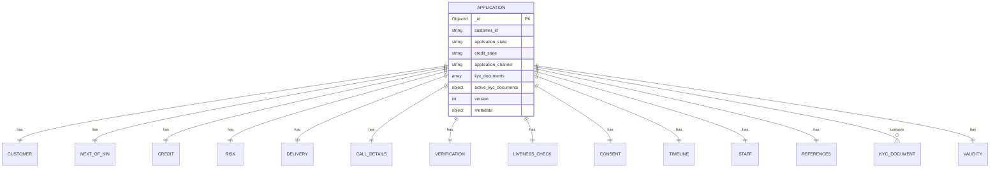

#### Field Mappings:

**From External Leads to Application:**
```typescript
{
  PhoneNumber: personal_info.phone_primary,
  Email: personal_info.email,
  CustomerID: identification.number,
  FullName: personal_info.full_name,
  utm_source: consent.source_of_information,
  Mode_of_payment: product.purchase_mode,
  Employment_status: employment.status,
  PreferredBuyingDate: timeline.device_needed,
  Agent_ID: staff.sales_agent.dsr_id,
  Submitting_Agent_Id: staff.submitting_agent.dsr_id
}
```

**From Prospects to Application:**
```typescript
{
  Phone: personal_info.phone_primary,
  CustomerID: identification.number,
  FirstName: personal_info.first_name,
  OtherNames: personal_info.other_name,
  ProductChoice: credit.product_id,
  SalesPerson: staff.sales_agent.dsr_id,
  Email: personal_info.email,
  CustomerLocation: location.county,
  BuyingOn: product.purchase_mode,
  KINFullNames: next_of_kin.full_name,
  KINRegisteredPhone: next_of_kin.phone_primary,
  // ... additional 50+ mapped fields
}
```

---

## 2. Phone Verification Transactions (MongoDB)

### MongoDB Collection: `phone_verification_transactions`

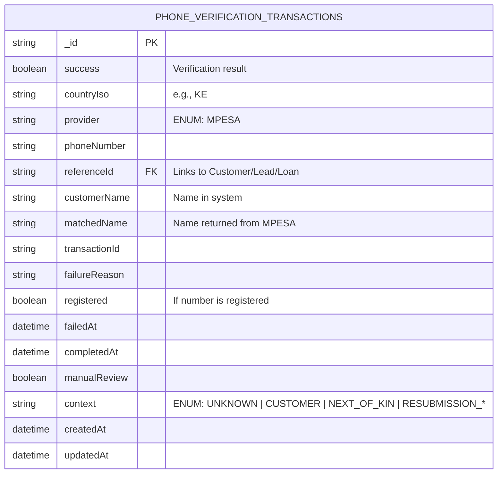

---

## 3. Mobile Money Analysis (MongoDB)

### Source Airtable Table:
- **MoReach Spin Data** (`MoReach Spin Data.csv`)

### MongoDB Collection: `money_statement_analysis`

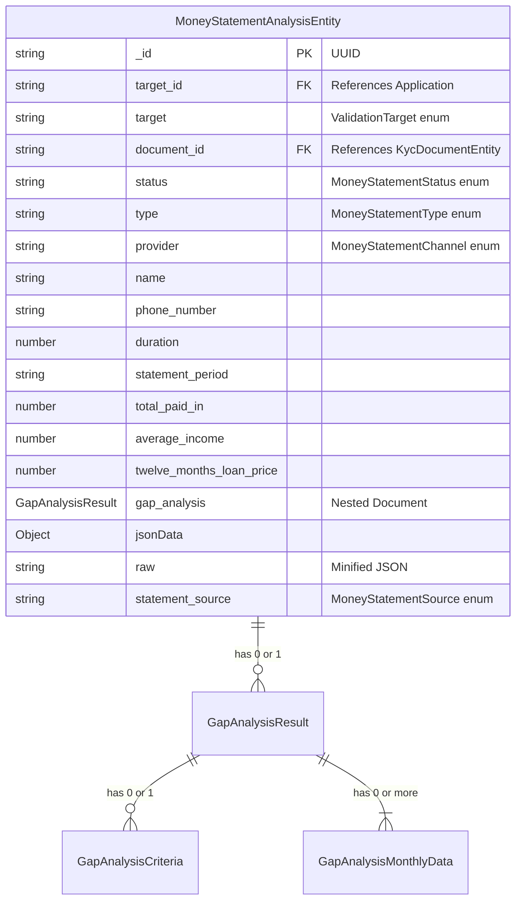

#### Airtable Mapping:
```typescript
{
  Name: data.name,
  CustomerId: application.customer.identification.number,
  PhoneNumber: data.phone_number,
  Email: data.email,
  Duration: data.duration,
  StatementPeriod: data.statement_period,
  AgentDeposit: data.agent_deposit,
  AirtimeHighest: data.airtime_highest,
  // ... 20+ additional financial metrics
  Affordability: data.affordability,
  AverageIncome: data.average_income,
  sourceDB: 'underwriting'
}
```

---

## 4. Credit Bureau Transactions (MongoDB)

### Source Airtable Tables:
- **Transunion Data** (`Transunion Data Grid View.csv`)
- **Metropol Data** (`Metropol Data Grid.csv`)

### MongoDB Collection: `credit_bureau_transactions`

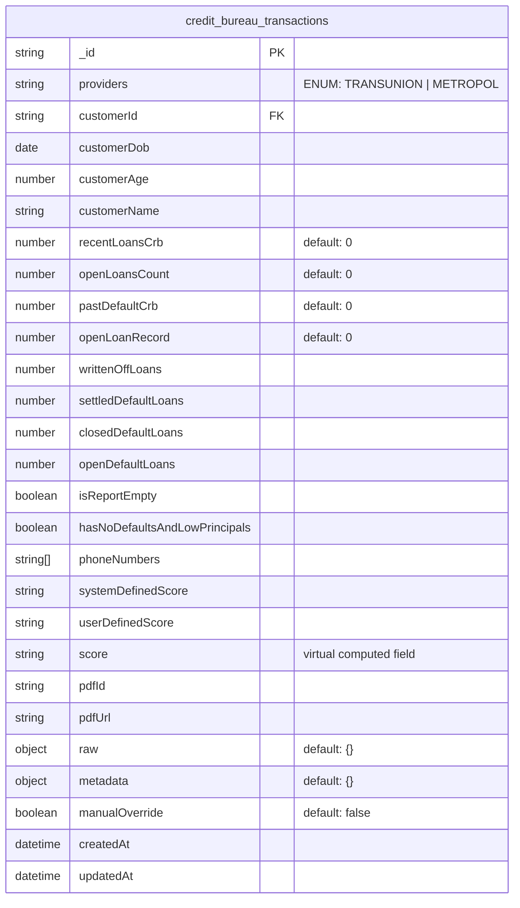

---

## 5. Call Disposition (MongoDB)

### Source Airtable Table:
- **Telesales Calls** (`Telesales Calls from MoReach.csv`)

### MongoDB Collection: `call_disposition`

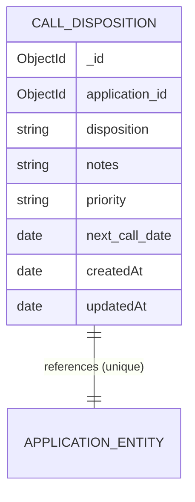

#### Airtable Mapping:
```typescript
{
  'External Lead': [application.recID],
  'Call Disposition': callDisposition.disposition,
  Notes: callDisposition.notes,
  'Next Call Date': callDisposition.next_call_date,
  CALLER_ID: application.staff.submitting_agent.dsr_id,
  Priority: callDisposition.priority
}
```

---

## 6. Customers Management (PostgreSQL)

### Source Airtable Table:
- **Customers Table** (`Customers Table.csv`)

### PostgreSQL Table: `customers`

```sql
CREATE TABLE customers (
    customer_id UUID PRIMARY KEY NOT NULL,
    application_id VARCHAR(255) NULL,
    customer_first_name VARCHAR(255) NOT NULL,
    customer_middle_name VARCHAR(255) NULL,
    customer_surname_name VARCHAR(255) NULL,
    customer_phone_number VARCHAR(20) UNIQUE NOT NULL,
    customer_national_id_number VARCHAR(255) UNIQUE NULL,
    customer_gender ENUM('male', 'female', 'other') NULL,
    customer_email_address VARCHAR(255) NULL,
    customer_secondary_phone VARCHAR(20) NULL,
    customer_source VARCHAR(50) NULL, -- 'airtable', 'other platform'
    customer_source_id VARCHAR(50) NULL, -- recId
    customer_status ENUM('active', 'suspended', 'closed') NOT NULL,
    selfie_url VARCHAR(500) NULL,
    id_front_url VARCHAR(500) NULL,
    id_back_url VARCHAR(500) NULL,
    referral_code VARCHAR(500) NULL,
    associated_phone_numbers TEXT[] NULL,
    customer_created_at TIMESTAMP NOT NULL DEFAULT NOW(),
    customer_updated_at TIMESTAMP NOT NULL DEFAULT NOW()
);
```

---

## 7. Blacklist/Risk Management (PostgreSQL)

### Source Airtable Table:
- **Primary Customer Data** (`Primary Customer Data.csv`)

### PostgreSQL Table: `blacklist`

```sql
CREATE TABLE blacklist (
    id UUID PRIMARY KEY,
    block_type ENUM('id_number', 'phone_number', 'imei', 'customer_id') NOT NULL,
    blocked_value VARCHAR(255) NOT NULL,
    customer_id UUID NULL REFERENCES customers(customer_id),
    phone_numbers TEXT[] NULL,
    associated_phone_numbers JSONB NULL,
    reason ENUM('fraud', 'default', 'duplicate', 'stolen_device', 'court_order', 'multiple_defaults', 'other') NOT NULL,
    description TEXT NULL,
    severity ENUM('temporary', 'permanent') NOT NULL,
    block_new_customers BOOLEAN DEFAULT TRUE,
    block_new_applications BOOLEAN DEFAULT TRUE,
    block_existing_sales BOOLEAN DEFAULT FALSE,
    is_active BOOLEAN DEFAULT TRUE,
    expires_at DATE NULL,
    created_by UUID NOT NULL,
    removed_by UUID NULL,
    removed_at TIMESTAMP NULL,
    removal_reason VARCHAR(255) NULL,
    created_at TIMESTAMP NOT NULL DEFAULT NOW(),
    updated_at TIMESTAMP NOT NULL DEFAULT NOW()
);
```

---

## 8. Customer Wallets (PostgreSQL)

### New Feature - No Direct Airtable Equivalent

### PostgreSQL Tables:

```sql
-- Customer Wallets
CREATE TABLE customer_wallets (
    customer_wallet_id UUID PRIMARY KEY,
    customer_id UUID NOT NULL REFERENCES customers(customer_id),
    customer_wallet_available_balance DECIMAL(10,2) DEFAULT 0,
    customer_wallet_total_payments DECIMAL(10,2) DEFAULT 0,
    customer_wallet_total_adjustments DECIMAL(10,2) DEFAULT 0,
    customer_wallet_total_days_given INTEGER DEFAULT 0,
    customer_wallet_total_points DECIMAL(10,2) DEFAULT 0,
    customer_wallet_total_allocated DECIMAL(10,2) DEFAULT 0,
    customer_wallet_lifetime_credits DECIMAL(10,2) DEFAULT 0,
    customer_wallet_lifetime_debits DECIMAL(10,2) DEFAULT 0,
    referral_code_usage_count DECIMAL(10,2) DEFAULT 0,
    customer_wallet_currency VARCHAR(3) DEFAULT 'KES',
    customer_wallet_created_at TIMESTAMP DEFAULT NOW(),
    customer_wallet_updated_at TIMESTAMP DEFAULT NOW()
);

-- Wallet Transactions
CREATE TABLE wallet_transactions (
    wallet_transaction_id UUID PRIMARY KEY,
    wallet_id UUID NOT NULL REFERENCES customer_wallets(customer_wallet_id),
    customer_id UUID NOT NULL REFERENCES customers(customer_id),
    sale_id UUID NULL, -- References sales table
    wallet_transaction_ref_id UUID NULL REFERENCES wallet_transactions(wallet_transaction_id),
    wallet_transaction_type ENUM('payment', 'allocation', 'adjustment', 'debit', 'transfer') NOT NULL,
    wallet_transaction_sub_type ENUM('mpesa', 'bank', 'cash', 'refund', 'reversal', 'penalty', 'bonus', 'days_given', 'points', 'referral_code_usage') NOT NULL,
    wallet_transaction_amount DECIMAL(10,2) NOT NULL,
    wallet_transaction_balance_before DECIMAL(10,2) NOT NULL,
    wallet_transaction_balance_after DECIMAL(10,2) NOT NULL,
    wallet_transaction_days_value INTEGER NULL,
    wallet_transaction_points_value DECIMAL(10,2) NULL,
    wallet_transaction_status ENUM('pending', 'completed', 'failed', 'reversed') DEFAULT 'pending',
    reference VARCHAR(255) NULL,
    wallet_transaction_description TEXT NULL,
    wallet_transaction_metadata JSONB NULL,
    wallet_transaction_created_at TIMESTAMP DEFAULT NOW(),
    wallet_transaction_updated_at TIMESTAMP DEFAULT NOW(),
    wallet_transaction_completed_at TIMESTAMP NULL
);
```

---

## 9. Customer Reviews (PostgreSQL)

### Source Airtable Table:
- **Customer Reviews** (`Customer Reviews Grid View.csv`)

### PostgreSQL Table: `reviews`

```sql
CREATE TABLE reviews (
    id UUID PRIMARY KEY,
    reviewable_type VARCHAR(50) NOT NULL, -- 'phone', 'onboarding', 'support_ticket', etc
    reviewable_id VARCHAR(255) NOT NULL,
    rating INTEGER CHECK (rating >= 1 AND rating <= 5),
    title VARCHAR(255) NULL,
    comment TEXT NULL,
    reviewer_id UUID NOT NULL,
    reviewer_type VARCHAR(50) NOT NULL, -- 'customer', 'agent', 'staff'
    reviewer_name VARCHAR(255) NULL,
    is_verified BOOLEAN DEFAULT FALSE,
    is_featured BOOLEAN DEFAULT FALSE,
    response_text TEXT NULL,
    response_by UUID NULL,
    response_at TIMESTAMPTZ NULL,
    helpful_count INTEGER DEFAULT 0,
    not_helpful_count INTEGER DEFAULT 0,
    status VARCHAR(50) DEFAULT 'pending', -- 'pending', 'approved', 'rejected'
    moderation_notes TEXT NULL,
    metadata JSONB NULL,
    created_at TIMESTAMPTZ DEFAULT NOW(),
    updated_at TIMESTAMPTZ DEFAULT NOW()
);
```

---

## 10. Sales/Loan Engine (PostgreSQL)

### Source Airtable Table:
- **Loans Table** (`Loans table.csv`)

### PostgreSQL Tables:

```sql
-- Main Sales Table
CREATE TABLE sales (
    sale_id UUID PRIMARY KEY,
    customer_id UUID NOT NULL REFERENCES customers(customer_id),
    priceplan_id UUID NOT NULL,
    inventory_id UUID NOT NULL,
    sale_date DATE NOT NULL,
    sale_type VARCHAR(50) NOT NULL,
    repayment_type VARCHAR(50) NOT NULL,
    initial_weeks_to_pay INTEGER NOT NULL,
    repay_rate DECIMAL(10,2) NOT NULL,
    total_paid DECIMAL(10,2) DEFAULT 0,
    total_discounts_deposit DECIMAL(10,2) DEFAULT 0,
    advance_lock DECIMAL(10,2) DEFAULT 0,
    returned BOOLEAN DEFAULT FALSE,
    fin_return_date DATE NULL,
    last_payment_date DATE NULL,
    grace_start_date DATE NULL,
    grace_end_date DATE NULL,
    grace_days DECIMAL(5,2) DEFAULT 0,
    sales_agent_dsr_id VARCHAR(50) NULL, -- Legacy DSR ID format: 900_Pato
    sales_agent_id VARCHAR(255) NULL, -- MongoDB ID for future use
    submitted_by_agent_dsr_id VARCHAR(50) NULL, -- Legacy DSR ID format: 456_Brian
    submitted_by_agent_id VARCHAR(255) NULL, -- Agent MongoDB ID for future use
    created_at TIMESTAMP DEFAULT NOW(),
    updated_at TIMESTAMP DEFAULT NOW()
);

-- Sales State Table (Computed/Derived Data)
CREATE TABLE sales_state (
    sale_id UUID PRIMARY KEY REFERENCES sales(sale_id),
    customer_age_days INTEGER NOT NULL, -- Days since sale_date
    initial_pay DECIMAL(10,2) NOT NULL, -- Deposit + first n weeks
    balance DECIMAL(10,2) NOT NULL, -- Remaining principal
    three_months_balance DECIMAL(10,2) NOT NULL,
    six_months_balance DECIMAL(10,2) NOT NULL,
    total_due_today DECIMAL(10,2) NOT NULL,
    arrears DECIMAL(10,2) NOT NULL,
    advance DECIMAL(10,2) NOT NULL,
    next_invoice_date DATE NULL,
    credit_expiry_date DATE NULL,
    days_past_due INTEGER NOT NULL,
    next_due_amount DECIMAL(10,2) NOT NULL,
    closing_balance DECIMAL(10,2) NULL,
    pay_off_3_6_months TEXT NULL, -- PAIDOFF_3MTH, PAIDOFF_6MTH, PAIDOFF_CASH, etc.
    account_status TEXT NOT NULL,
    is_in_grace_period BOOLEAN DEFAULT FALSE,
    updated_at TIMESTAMP DEFAULT NOW()
);

-- Sales Overrides Table
CREATE TABLE sales_overrides (
    override_id UUID PRIMARY KEY,
    sale_id UUID NOT NULL REFERENCES sales(sale_id),
    field_name VARCHAR(100) NOT NULL,
    old_value TEXT NULL,
    new_value TEXT NOT NULL,
    reason TEXT NOT NULL,
    approved_by VARCHAR(255) NOT NULL,
    created_at TIMESTAMP DEFAULT NOW()
);
```

---

## 11. Orders and Delivery (PostgreSQL)

### Source Airtable Tables:
- **Deposit Deliveries Out for Delivery** (`Deposit Deliveries Out for Delivery.csv`)
- **Rider App Logs** (`Rider App Logs from MoReach.csv`)

### PostgreSQL Tables:

```sql
-- Orders Table
CREATE TABLE orders (
    id UUID PRIMARY KEY,
    tenant_id UUID NOT NULL,
    loan_application_id UUID NOT NULL, -- References application in MongoDB
    status VARCHAR(50) NOT NULL,
    payment_status VARCHAR(50) NOT NULL,
    items JSONB NOT NULL,
    total_amount DECIMAL(10,2) NOT NULL,
    discount_amount DECIMAL(10,2) DEFAULT 0,
    currency VARCHAR(3) DEFAULT 'KES',
    shipping_address JSONB NOT NULL,
    metadata JSONB NULL,
    manual_override BOOLEAN DEFAULT FALSE,
    created_at TIMESTAMP DEFAULT NOW(),
    updated_at TIMESTAMP DEFAULT NOW()
);

-- Deliveries Table
CREATE TABLE deliveries (
    id UUID PRIMARY KEY,
    order_id UUID NOT NULL REFERENCES orders(id),
    rider_id UUID NOT NULL,
    provider_info JSONB NULL,
    status VARCHAR(50) NOT NULL,
    picked_up_at TIMESTAMP NULL,
    delivered_at TIMESTAMP NULL,
    estimated_delivery_at TIMESTAMP NULL,
    current_location JSONB NULL,
    delivery_notes JSONB NULL,
    adjustments JSONB NULL,
    delivery_fee DECIMAL(10,2) DEFAULT 0,
    tracking_number VARCHAR(255) UNIQUE NULL,
    delivery_consent JSONB NULL, -- OTP consent structure
    metadata JSONB NULL,
    manual_override BOOLEAN DEFAULT FALSE,
    created_at TIMESTAMP DEFAULT NOW(),
    updated_at TIMESTAMP DEFAULT NOW()
);
```

**Delivery Consent Structure:**
```json
{
  "otp_code": "string",
  "otp_sent_at": "2024-01-01T00:00:00Z",
  "otp_verified_at": "2024-01-01T00:00:00Z",
  "phone_number": "string",
  "consent_type": "otp|signature|photo",
  "attempts": 0,
  "max_attempts": 3
}
```

---

## 12. Additional MongoDB Collections

### Fate Guide Transactions
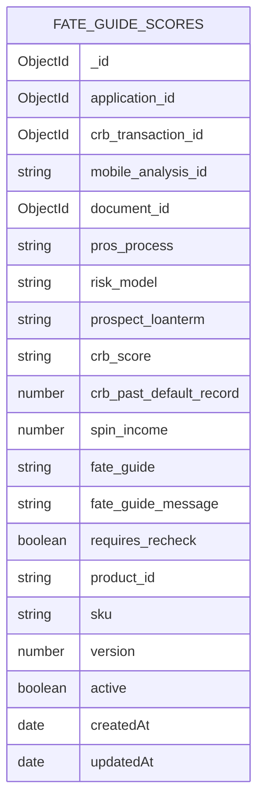

### Liveness Check Transactions
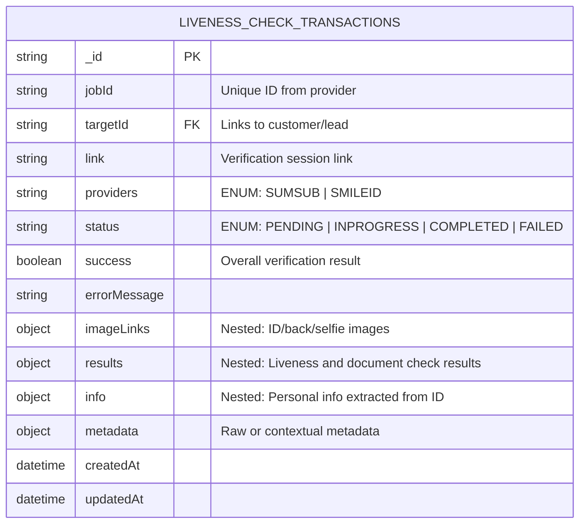

### KYC Documents
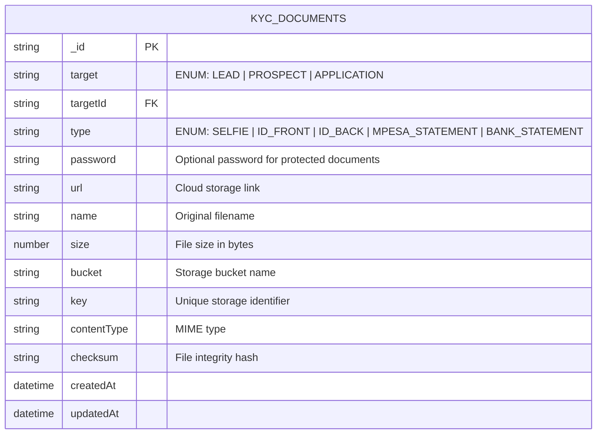

### Identity Verification Transactions
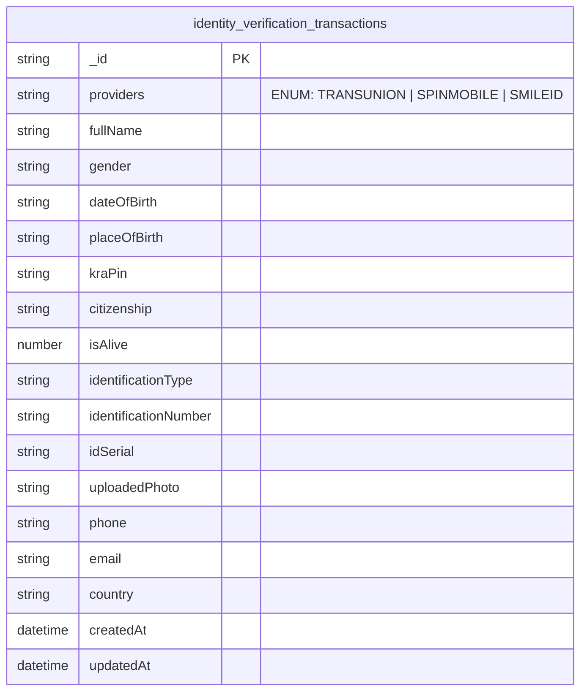

### Tax Verification Transactions
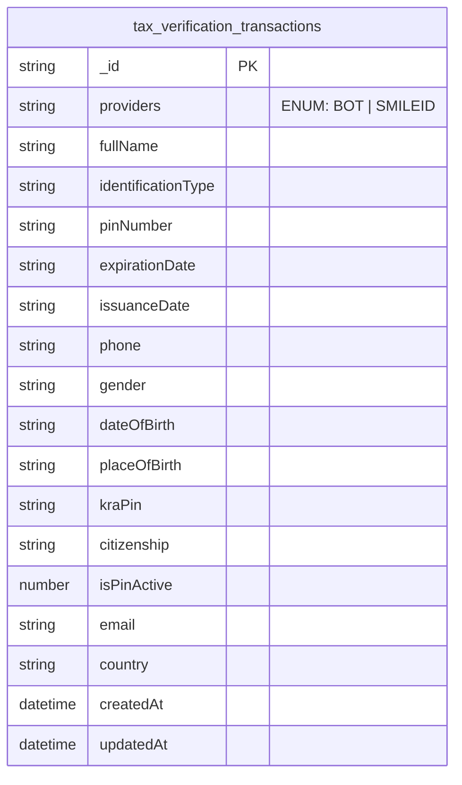

### Validation Records
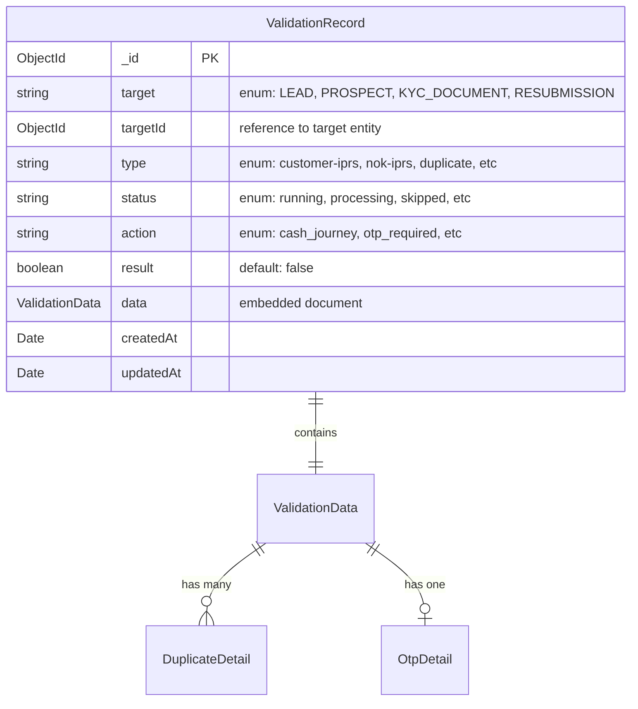

### Resubmissions
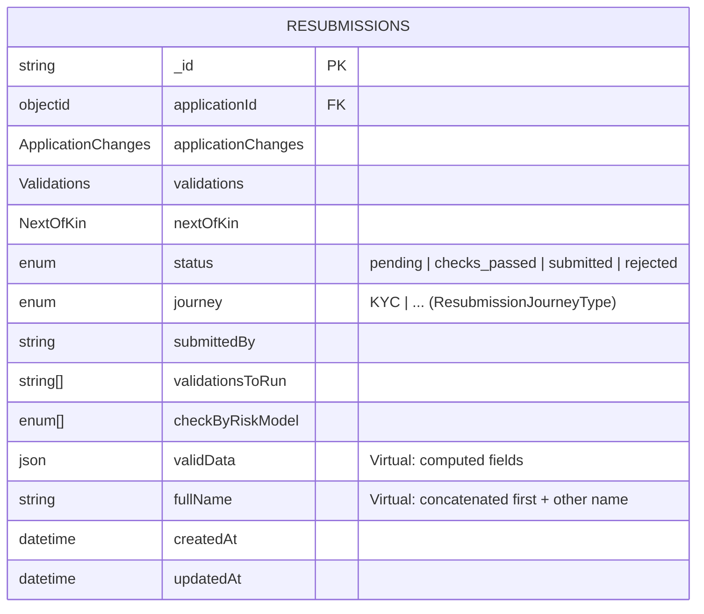

### Notifications
### Source Airtable Table:
- **MoReach Notification Logs** (`MoReach Notification Logs.csv`)

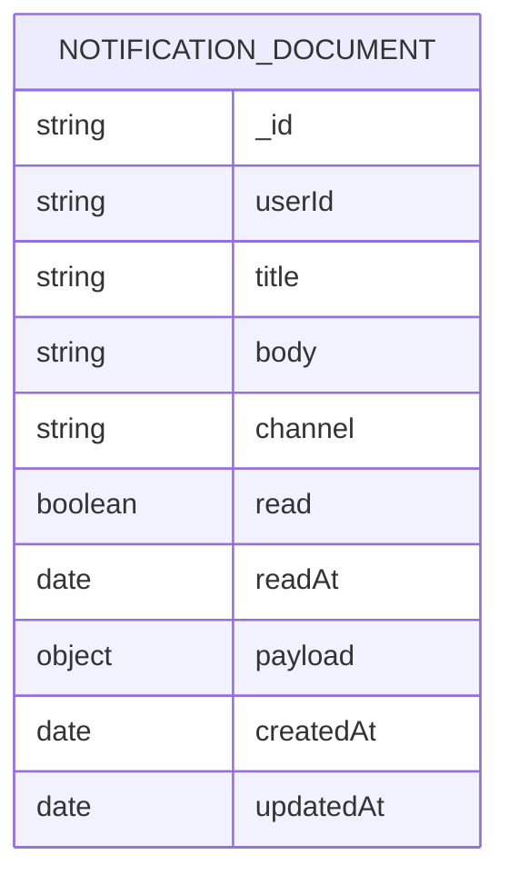

---

## Data Migration Strategy

### Phase 1: Core Infrastructure
1. Set up PostgreSQL schemas for structured data
2. Set up MongoDB collections for unstructured data
3. Create indexes and constraints

### Phase 2: Customer Data Migration
1. Migrate customer records from Airtable to PostgreSQL
2. Create customer wallets for existing customers
3. Migrate blacklist/risk data

### Phase 3: Application Data Migration
1. Migrate application data to MongoDB
2. Link applications to PostgreSQL customer records
3. Migrate verification and analysis data

### Phase 4: Sales and Financial Data
1. Migrate sales/loan data to PostgreSQL
2. Calculate and populate sales_state table
3. Migrate wallet transactions

### Phase 5: Operational Data
1. Migrate orders and delivery data
2. Migrate reviews and customer experience data
3. Migrate notification logs

### Phase 6: Validation and Cleanup
1. Validate data integrity between systems
2. Set up cross-database references
3. Archive old Airtable data

---

## Cross-Database Relationships

### Application (MongoDB) ↔ Customer (PostgreSQL)
- Applications reference customers via `customer_id`
- Customers can have multiple applications

### Sales (PostgreSQL) ↔ Application (MongoDB)
- Sales reference applications via `application_id` in metadata
- Applications can result in multiple sales

### Orders (PostgreSQL) ↔ Application (MongoDB)
- Orders reference applications via `loan_application_id`
- Applications can have multiple orders

---

## Performance Considerations

### PostgreSQL Optimizations
- Index on frequently queried fields (customer_phone_number, customer_national_id_number)
- Partition large tables (wallet_transactions) by date
- Use materialized views for complex sales_state calculations

### MongoDB Optimizations
- Compound indexes on query patterns (application_state + customer.phone_primary)
- TTL indexes for temporary data (validation_records)
- Shard by customer_id for large collections

### Cross-Database Queries
- Use application-level joins rather than database joins
- Cache frequently accessed cross-reference data
- Implement eventual consistency patterns where appropriate

---

## Validation Rules

### Data Integrity
1. Customer phone numbers must be unique across systems
2. Application references must exist in both databases
3. Financial calculations must balance across wallet transactions
4. All monetary values must be non-negative except for adjustments

### Business Rules
1. Customers cannot have active sales while blacklisted
2. Applications must pass all required validations before approval
3. Delivery cannot be completed without proper consent verification
4. Wallet balance cannot go negative without explicit approval

---

## Monitoring and Alerts

### Data Quality Monitoring
- Daily reconciliation between Airtable and new databases
- Automated validation of critical business rules
- Alert on data inconsistencies or failed migrations

### Performance Monitoring
- Query performance tracking for cross-database operations
- Storage utilization monitoring
- Index usage analysis and optimization

This comprehensive documentation provides a complete mapping between Airtable tables, ERD structures, and the target PostgreSQL/MongoDB schemas, enabling a successful migration while maintaining data integrity and business logic.