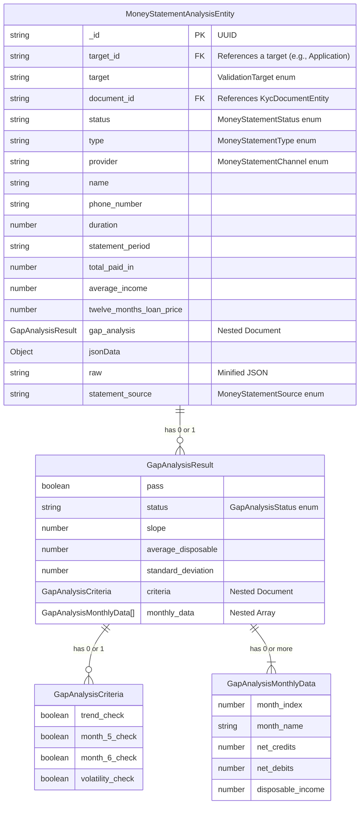
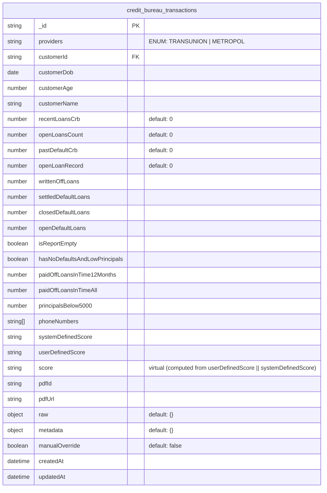

# Applications

### Applications
This replaces Leads and prospects
Applications mapping to Airtable:
I jist need documentation of this
Applications to External Leads table -> /Users/patrickwaweru/development/mo/airtable-migration/Airtable/External Leads.csv

```ts
 private mapLeadToExternalLeads(application: ApplicationEntity) {
    // Define which metadata fields to map to airtable
    const allowedMetadataKeys = [
      'ProductID',
      'Billing_Region',
      'Buy_Details',
      'utm_medium',
      'utm_campaign',
      'utm_referral',
      'gclid',
      'DataCollectionConsentText',
      'utm_term',
      'utm_content',
      'Details',
    ];
    // Filter metadata to only include allowed keys
    const filteredMetadata = application?.metadata
      ? Object.keys(application.metadata)
          .filter((key) => allowedMetadataKeys.includes(key))
          .reduce((obj, key) => {
            obj[key] = application.metadata[key];
            return obj;
          }, {} as any)
      : {};
    const { customer, consent, metadata, timeline, staff } = application;
    const { personal_info, identification, product, employment } = customer;
    return {
      PhoneNumber: personal_info?.phone_primary,
      Email: personal_info?.email,
      CustomerID: identification?.number,
      FullName: personal_info?.full_name,
      utm_source: consent?.source_of_information || metadata?.utm_source,
      'Mode of payment':
        product?.purchase_mode === PurchaseMode.CASH ? 'Cash' : 'Loan',
      Employment_status: employment?.status,
      PreferredBuyingDate: timeline?.device_needed,
      'Agent ID': [staff?.sales_agent?.dsr_id],
      'Submitting Agent Id': [staff?.submitting_agent?.dsr_id],
      // Spread only the filtered metadata
      ...filteredMetadata,
    };
  }
```

Applications to Prospects Table -> 
```ts
  async mapProspectsToAirtable(application?: ApplicationEntity): Promise<any> {
    const { customer, staff, next_of_kin, consent, timeline, credit } =
      application;
    const {
      personal_info,
      identification,
      location,
      product,
      employment,
      credit_history,
    } = customer;
    const productDetails = await this.productRepository.findById(
      this.sanitizeId(credit?.product_id) ??
        this.sanitizeId(customer?.product?.id),
    );
    return {
      Phone: personal_info?.phone_primary,
      CustomerID: identification?.number,
      FirstName: personal_info?.first_name,
      OtherNames: personal_info?.other_name,
      ProductChoice: [productDetails.recid],
      SalesPerson: [staff?.sales_agent?.dsr_id],
      'Submitting SalesPerson': [staff?.submitting_agent?.dsr_id],
      '1-1ExterenalLeadLink': [personal_info?.phone_primary],
      Email: personal_info?.email,
      CustomerLocation: location?.county,
      BuyingOn: product?.purchase_mode === 'LOAN' ? 'Loan' : 'Cash',
      KINFullNames: `${next_of_kin?.full_name}`,
      KINRegisteredPhone: next_of_kin?.phone_primary,
      Alternative_contact_type: next_of_kin?.relationship,
      Alternative_contact_IDNumber: next_of_kin?.identification?.number,
      HearAboutUs: consent?.source_of_information,
      Employment_status: employment?.status,
      Most_recent_incomedate: credit_history?.last_income_date,
      Next_expected_incomedate: credit_history?.next_income_date,
      TakenLoansBefore: this.airtableBridgeUtilService.mapBoolean(
        credit_history?.previous_loans,
      ),
      Customer_confirms_has_ever_defaulted: this.airtableBridgeUtilService
        .mapNullableBoolean(credit_history?.defaulted_loans)
        .toUpperCase(),
      Customer_confirms_has_openloans: this.airtableBridgeUtilService
        .mapNullableBoolean(credit_history?.active_loans)
        .toUpperCase(),
      Customer_confirms_if_beendenied_loan: this.airtableBridgeUtilService
        .mapBoolean(credit_history?.loan_denials)
        .toUpperCase(),
      CustomerConfirmsLocation: location?.county,
      chosen_deliver_location: product?.delivery_location,
      JobDescription: employment?.title,
      EmployerName: employment?.location,
      Current_phone_model_usedbycustomer: credit_history?.previous_device,
      PreferredBuyingDate: timeline?.device_needed,
      'Loan Term': loanTypeToRepaymentPeriod(product?.product_repayment_period),
      application_id: application._id.toString(),
      kra_pin: personal_info?.kra_pin,
      kra_or_bank: personal_info?.kra_pin
        ? 'KRA Pin'
        : '2 Months Bank Statement',
      document_consent: consent?.verified ? 'Yes' : 'No',
      ReferredUserName: consent?.referrer_name,
      ...(credit?.check_by_risk_model?.length > 0 && {
        Check_by_RISKMODEL: credit?.check_by_risk_model,
      }),
    };
  }

  async mapDocumentsToAirtable(
    application?: ApplicationEntity,
    documentIds?: any[],
  ): Promise<any> {
    const kycDocuments = application?.kyc_documents;
    if (!kycDocuments) {
      return undefined;
    }
    // fetch airtable documents first
    const prospectAirtable = await this.airtableService.retrieveRecord(
      'Prospects',
      `{application_id} = '${application._id}'`,
      [
        'front_id_photo',
        'back_id_photo',
        'six_months_MPESA_statement',
        'customer_holding_ID',
        'selfie_photo',
        'bank_statement',
        'password_MPESA_statement',
        'bank_statement_pin',
      ],
    );
    let underwritingDocs = [];
    // 1. if documentIds is provided, fetch the documents from the database
    if (documentIds) {
      underwritingDocs = await this.kycDocumentsRepository.findAll({
        _id: { $in: documentIds },
      });
    } else {
      // 2. iffetch underwriting documents
      underwritingDocs = await this.kycDocumentsRepository.findAll({
        targetId: application._id.toString(),
      });
    }
    // extract selfies, backid, front id, mpesa statement, bank statement
    const selfies =
      underwritingDocs.filter((doc) => doc.type === KycDocumentType.SELFIE) ??
      [];
    const backIds =
      underwritingDocs.filter((doc) => doc.type === KycDocumentType.ID_BACK) ??
      [];
    const frontIds =
      underwritingDocs.filter((doc) => doc.type === KycDocumentType.ID_FRONT) ??
      [];
    const mpesaStatements =
      underwritingDocs.filter(
        (doc) => doc.type === KycDocumentType.MPESA_STATEMENT,
      ) ?? [];
    const bankStatements =
      underwritingDocs.filter(
        (doc) => doc.type === KycDocumentType.BANK_STATEMENT,
      ) ?? [];

    // existing mpesa statement password
    const existingMpesaStatementPassword =
      prospectAirtable?.password_MPESA_statement ?? '';
    // existing bank statement password
    const existingBankStatementPassword =
      prospectAirtable?.bank_statement_pin ?? '';

    const filteredMpesaStatements =
      this.airtableBridgeUtilService.filterUniqueDocuments(
        prospectAirtable?.six_months_MPESA_statement,
        mpesaStatements,
      );
    const filteredBankStatements =
      this.airtableBridgeUtilService.filterUniqueDocuments(
        prospectAirtable?.bank_statement,
        bankStatements,
      );

    const newMpesaPasswords = filteredMpesaStatements
      .map((item) => item.password)
      .filter(Boolean);

    let updatedPassword_MPESA_statement;
    if (newMpesaPasswords.length === 0) {
      updatedPassword_MPESA_statement = undefined;
    } else {
      const allPasswords = [
        ...(existingMpesaStatementPassword
          ? existingMpesaStatementPassword.split(',')
          : []),
        ...newMpesaPasswords,
      ].filter(Boolean);
      updatedPassword_MPESA_statement = allPasswords.join(',');
    }

    //
    const newBankPasswords = filteredBankStatements
      .map((item) => item.password)
      .filter(Boolean);

    let updatedBank_statement_pin;
    if (newBankPasswords.length === 0) {
      updatedBank_statement_pin = undefined;
    } else {
      const allPasswords = [
        ...(existingBankStatementPassword
          ? existingBankStatementPassword.split(',')
          : []),
        ...newMpesaPasswords,
      ].filter(Boolean);
      updatedBank_statement_pin = allPasswords.join(',');
    }

    return {
      customer_holding_ID: [
        ...(prospectAirtable?.customer_holding_ID || []),
        ...this.airtableBridgeUtilService
          .filterUniqueDocuments(prospectAirtable?.customer_holding_ID, selfies)
          .map(this.airtableBridgeUtilService.formatDoc),
      ],
      back_id_photo: [
        ...(prospectAirtable?.back_id_photo || []),
        ...this.airtableBridgeUtilService
          .filterUniqueDocuments(prospectAirtable?.back_id_photo, backIds)
          .map(this.airtableBridgeUtilService.formatDoc),
      ],
      front_id_photo: [
        ...(prospectAirtable?.front_id_photo || []),
        ...this.airtableBridgeUtilService
          .filterUniqueDocuments(prospectAirtable?.front_id_photo, frontIds)
          .map(this.airtableBridgeUtilService.formatDoc),
      ],
      six_months_MPESA_statement: [
        ...(prospectAirtable?.six_months_MPESA_statement || []),
        ...this.airtableBridgeUtilService
          .filterUniqueDocuments(
            prospectAirtable?.six_months_MPESA_statement,
            mpesaStatements,
          )
          .map(this.airtableBridgeUtilService.formatDoc),
      ],
      bank_statement: [
        ...(prospectAirtable?.bank_statement || []),
        ...this.airtableBridgeUtilService
          .filterUniqueDocuments(
            prospectAirtable?.bank_statement,
            bankStatements,
          )
          .map(this.airtableBridgeUtilService.formatDoc),
      ],
      ...(updatedPassword_MPESA_statement && {
        password_MPESA_statement: updatedPassword_MPESA_statement,
      }),
      ...(updatedBank_statement_pin && {
        bank_statement_pin: updatedBank_statement_pin,
      }),
    };
  }

```

```
erDiagram
    APPLICATION ||--|| CUSTOMER : has
    APPLICATION ||--|| NEXT_OF_KIN : has
    APPLICATION ||--|| CREDIT : has
    APPLICATION ||--|| RISK : has
    APPLICATION ||--|| DELIVERY : has
    APPLICATION ||--|| CALL_DETAILS : has
    APPLICATION ||--|| VERIFICATION : has
    APPLICATION ||--|| LIVENESS_CHECK : has
    APPLICATION ||--|| CONSENT : has
    APPLICATION ||--|| TIMELINE : has
    APPLICATION ||--|| STAFF : has
    APPLICATION ||--|| REFERENCES : has
    APPLICATION ||--o{ KYC_DOCUMENT : contains
    APPLICATION ||--|| VALIDITY : has
    
    CUSTOMER ||--|| PERSONAL_INFO : has
    CUSTOMER ||--|| IDENTIFICATION : has
    CUSTOMER ||--|| LOCATION : has
    CUSTOMER ||--|| EMPLOYMENT : has
    CUSTOMER ||--|| CREDIT_HISTORY : has
    CUSTOMER ||--|| PRODUCT : selects
    
    CREDIT ||--|| PRE_SCREENING_RESULT : has
    
    APPLICATION {
        ObjectId _id PK
        string customer_id
        string application_state
        string credit_state
        string application_channel
        array kyc_documents
        object active_kyc_documents
        int version
    }
    
    CUSTOMER {
        string customer_id FK
    }
    
    PERSONAL_INFO {
        string first_name
        string middle_names
        string last_name
        string email
        string phone_primary
        string phone_secondary
    }
    
    IDENTIFICATION {
        string type
        string number
    }
    
    LOCATION {
        string county
        string country
    }
    
    EMPLOYMENT {
        string status
        string title
        string location
        string duration
    }
    
    CREDIT_HISTORY {
        boolean active_loans
        boolean defaulted_loans
        string previous_device
    }
    
    PRODUCT {
        string id
        string name
        string delivery_location
        string purchase_mode
        string product_repayment_period
    }
    
    NEXT_OF_KIN {
        string first_name
        string middle_name
        string last_name
        string relationship
        string phone_primary
        string phone_secondary
        string id_type
        string id_number
    }
    
    CREDIT {
        string credit
        array credit_process
        array pending_kyc_tags
        string system_crb_score
        string user_crb_score
        string status
        string prospect_status
        string prospect_model
        string customer_bucket
        string customer_tag
        array check_by_risk_model
        string fate_guide
        string combined_risk_flag
        string risk_flag
        string deposit_requirement
        string advice_customer
        string customer_credit_fate_reason
        datetime last_modified_credit_status
        datetime approved_at
        string product_id
        string product_name
        string price_plan_id
        string price_plan_name
        string resubmission_link
        int initial_weeks
    }
    
    VALIDITY {
        object mpesaStatement
        object bankStatement
        object frontId
        object backId
        object selfie
        object kra
        object nok
    }
    
    RISK {
        string risk_flag
        string previous_loans
        string high_deposit_overide
    }
    
    DELIVERY {
        string rider_id
        string mpesa_code
        string delivery_code
        string rider_submitted_otp
        datetime otp_expiry_time
        object location
        string front_id
        string back_id
        string delivery_status
        string notes
    }
    
    CALL_DETAILS {
        string status
        string notes
        string agent_name
        string caller_id
        string delivery_location_type
        string priority
        datetime call_date
        boolean follow_up_required
        string credit_call_link
    }
    
    VERIFICATION {
        string identity_verification
        string mpesa_verification
        string duplicate_check
    }
    
    LIVENESS_CHECK {
        string method
        string link
    }
    
    CONSENT {
        boolean sales_approval
        boolean terms_and_conditions
        string source_of_information
        boolean verified
        string verification_phone
        string otp
        datetime created_at
        datetime verified_at
    }
    
    TIMELINE {
        datetime lead_created
        datetime prospect_created
        datetime customer_created
        datetime ready_for_screening
        datetime ready_for_scoring
        datetime ready_for_calling
        datetime ready_for_decision
        datetime screened_at
        datetime called_at
        datetime scored_at
        datetime decisioned_at
        datetime device_needed
        datetime liveness_created_date
    }
    STAFF {
        object screener
        object scorer
        object caller
        object decisioner
        object sales_agent
        object submitting_agent
    }
    
    REFERENCES {
        string lead_id
        string prospect_id
        string customer_id
        string crb_transaction_id
        string resubmission_id
    }
    
    KYC_DOCUMENT {
        ObjectId _id PK
        string document_type
        string document_status
        datetime uploaded_at
        string validator_id
    }
    
		PRE_SCREENING_RESULT {
        string result
        string price_band
        boolean has_devices
    }
```

### Phone Verification Transactions
    
    ```mermaid
    erDiagram
        PHONE_VERIFICATION_TRANSACTIONS {
            string _id PK
            boolean success "Verification result"
            string countryIso "e.g., KE"
            string provider "ENUM: MPESA"
            string phoneNumber
            string referenceId FK "Links to Customer/Lead/Loan"
            string customerName "Name in system"
            string matchedName "Name returned from MPESA"
            string transactionId
            string failureReason
            boolean registered "If number is registered"
            datetime failedAt
            datetime completedAt
            boolean manualReview
            string context "ENUM: UNKNOWN | CUSTOMER | NEXT_OF_KIN | RESUBMISSION_*"
            datetime createdAt
            datetime updatedAt
        }
    
    ```
    
### Mobile Money Analysis
Mobile Money Analysis to External Leads table -> /Users/patrickwaweru/development/mo/airtable-migration/Airtable/MoReach Spin Data.csv

```ts
  private async extractMPESAInfo(
    data: MoneyStatementAnalysisEntity,
  ): Promise<Record<string, any> | null> {
    if (!data) return null;

    let customerId = 'Unknown';

    // If we need to get customerId from prospect, fetch it
    if (data.target_id && customerId === 'Unknown') {
      try {
        const application = await this.applicationsRepository.findById(
          data.target_id,
        );
        customerId = application?.customer?.identification?.number;
      } catch (error) {
        this.logger.warn(`Failed to fetch prospect for ID: ${data.target_id}`);
      }
    }

    return {
      Name: data.name,
      CustomerId: customerId,
      PhoneNumber: data.phone_number,
      Email: data.email,
      Duration: data.duration,
      StatementPeriod: data.statement_period,
      AgentDeposit: data?.agent_deposit,
      AirtimeHighest: data?.airtime_highest,
      InternetBundleHighest: data?.internet_bundle_highest,
      PersonsReceivedFromTotal: data?.persons_received_from_total,
      BanksReceived: data?.banks_received,
      MFIsReceived: data?.mfis_received,
      MobileLendersReceived: data?.mobile_lenders_received,
      HealthcareReceived: data?.healthcare_received,
      SaccosReceived: data?.saccos_received,
      InsuranceReceived: data?.insurance_received,
      BettingReceived: data?.betting_received,
      OthersReceived: data?.others_received,
      AirtimeTotal: data?.airtime_total,
      InternetBundleTotal: data?.internet_bundle_total,
      TotalPaidIn: data?.total_paid_in,
      TotalPaidInAverage: data?.total_paid_in_average,
      TotalOthers: data?.total_others,
      Affordability: data.affordability,
      AverageIncome: data.average_income,
      sourceDB: 'underwriting',
    };
  }
```    


    
### Fate Guide Transactions
    
    ```mermaid
    erDiagram
        FATE_GUIDE_SCORES {
            ObjectId _id
    
            %% ===== References =====
            ObjectId application_id
            ObjectId crb_transaction_id
            string   mobile_analysis_id
            ObjectId document_id
    
            %% ===== Input Fields =====
            string pros_process
            string risk_model
            string prospect_loanterm
            string crb_score
            number crb_past_default_record
            number spin_income
            number initial_credit_payment
            number fin_12_month_loan_price
            number actual_loan_price
            number fin_cash_price
            string previous_loans
            string spin_airtime_band
    
            %% ===== Derived / Band Fields =====
            string age_band23
            string age_band
            number customer_age
            string big_loan_default
            string crb_score_band
            number spin_income_multiplier
            string spin_income_cover
            string offer_price_band
    
            %% ===== Model Results =====
            string model_type
            string fate_model
            string fate_guide
            string fate_guide_message
            boolean requires_recheck
    
            %% ===== Product & Offer Controls =====
            string sale_agent_id
            string[] allowed_price_plans
            object price_restrictions
            map restrictions_by_plan
    
            %% ===== Product Identity =====
            string product_id
            string sku
    
            %% ===== Control & Metadata =====
            number version
            string type
            boolean active
            date createdAt
            date updatedAt
        }
    
        APPLICATIONS {
            ObjectId _id
        }
    
        CRB_TRANSACTIONS {
            ObjectId _id
        }
    
        MOBILE_ANALYSIS {
            ObjectId _id
        }
    
        KYC_DOCUMENTS {
            ObjectId _id
        }
    
        FATE_GUIDE_SCORES ||--|| APPLICATIONS : "application_id"
        FATE_GUIDE_SCORES ||--|| CRB_TRANSACTIONS : "crb_transaction_id"
        FATE_GUIDE_SCORES ||--|| MOBILE_ANALYSIS : "mobile_analysis_id"
        FATE_GUIDE_SCORES ||--|| KYC_DOCUMENTS : "document_id"
    
    ```
    
### Liveness Check Transactions
    
    ```mermaid
    erDiagram
        LIVENESS_CHECK_TRANSACTIONS {
            string _id PK
            string jobId "Unique ID from provider"
            string targetId FK "Links to customer/lead"
            string link "Verification session link"
            string providers "ENUM: SUMSUB | SMILEID"
            string status "ENUM: PENDING | INPROGRESS | COMPLETED | FAILED"
            boolean success "Overall verification result"
            string errorMessage
            object imageLinks "Nested: ID/back/selfie images"
            object results "Nested: Liveness and document check results"
            object info "Nested: Personal info extracted from ID"
            object metadata "Raw or contextual metadata"
            datetime createdAt
            datetime updatedAt
        }
    
        IMAGE_LINKS {
            string[] id_card_back
            string[] id_card_image
            string[] selfie_image
        }
    
        RESULTS {
            string documentCheck
            string livenessCheck
            string registerSelfie
            string verifyDocument
            string selfieToIDCardCompare
            string humanReviewDocumentCheck
            string humanReviewLivenessCheck
        }
    
        INFO {
            string firstName
            string lastName
            string middleName
            string gender
            string dob
            string country
            string idNumber
            string idType
        }
    
        %% Relationships
        LIVENESS_CHECK_TRANSACTIONS ||--|{ IMAGE_LINKS : "has"
        LIVENESS_CHECK_TRANSACTIONS ||--|{ RESULTS : "includes"
        LIVENESS_CHECK_TRANSACTIONS ||--|{ INFO : "contains"
    
    ```
    
### KYC Documents
Airtable just has links for this
    ```mermaid
    erDiagram
        KYC_DOCUMENTS {
            string _id PK "Unique identifier for the document"
            string target "ENUM: LEAD | PROSPECT | APPLICATION - defines where the document belongs"
            string targetId FK "ObjectId → Lead/Prospect/Application record"
            string type "ENUM: SELFIE | ID_FRONT | ID_BACK | MPESA_STATEMENT | BANK_STATEMENT"
            string password "Optional - used if the document is password protected"
            string url "Cloud or file storage link (e.g., S3 signed URL)"
            string name "Original filename uploaded by user"
            number size "File size in bytes"
            string bucket "S3 bucket name or equivalent storage location"
            string key "S3 object key or unique storage identifier"
            string contentType "MIME type, e.g., image/jpeg, application/pdf"
            string checksum "MD5 or SHA hash to verify file integrity"
            datetime createdAt "Timestamp when the document was first created"
            datetime updatedAt "Timestamp of the last update"
        }
    
        %% Relationships (Optional for clarity)
        LEAD ||--o{ UNDERWRITING_KYC_DOCUMENTS : "owns"
        PROSPECT ||--o{ UNDERWRITING_KYC_DOCUMENTS : "owns"
        APPLICATION ||--o{ UNDERWRITING_KYC_DOCUMENTS : "owns"
    ```
    
### Call Disposition
This replaces TeleSales Calls and
I jist need documentation of this
Call Disposition mapping to Airtable: -> /Users/patrickwaweru/development/mo/airtable-migration/Airtable/Telesales Calls from MoReach.csv

```ts
   async createCallDisposition(
    callDisposition: CallDispositionEntityDto,
  ): Promise<CallDispositionEntityDto> {
    try {
      if (callDisposition.application_id) {
        const application = await this.applicationsRepository.findById(
          callDisposition.application_id,
        );
        if (!application) {
          throw new Error(
            `Application not found for ID: ${callDisposition.application_id}`,
          );
        }
        const queryOptions: AirtableQueryOptions = {
          tableName: 'External leads',
          fields: ['RecID'],
          filterByFormula: `{application_id} = '${callDisposition.application_id}'`,
          maxRecords: 1,
          sort: [{ field: 'Created', direction: 'desc' }],
        };
        const existingLeadRecords =
          await this.airtableService.getRecords(queryOptions);
        const recID = existingLeadRecords[0]['RecID'];
        if (recID) {
          const callDispositionData = {
            'External Lead': [recID.trim()],
            'Call Disposition': callDisposition.disposition,
            Notes: callDisposition.notes,
            'Next Call Date': callDisposition.next_call_date,
            CALLER_ID: application.staff?.submitting_agent?.dsr_id || '',
            Priority: callDisposition.priority,
          };
          await this.airtableService.createRecord(
            'Telesales Calls',
            callDispositionData,
            true,
          );
        }
      }
      return callDisposition;
    } catch (error) {
      this.logger.error(
        `Error creating call disposition in Airtable: ${error.message}`,
        error.stack,
      );
      throw error;
    }
  }
```

    ```mermaid
    erDiagram
      
        CALL_DISPOSITION {
            ObjectId _id
            ObjectId application_id
            string disposition
            string notes
            string priority
            date next_call_date
            date createdAt
            date updatedAt
        }
    
        CALL_DISPOSITION ||--|| APPLICATION_ENTITY : "references (unique)"
    
    ```
    
### Identity Verification Transactions
    
    ```mermaid
    erDiagram
        identity_verification_transactions {
            string _id PK
            string providers "ENUM: TRANSUNION | SPINMOBILE | SMILEID"
            string fullName
            string gender
            string dateOfBirth
            string placeOfBirth
            string kraPin
            string citizenship
            number isAlive
            string identificationType
            string identificationNumber
            string idSerial
            string uploadedPhoto
            string phone
            string email
            string country
            datetime createdAt
            datetime updatedAt
        }
    
    ```
    
### Credit Bureau Transactions
This table replace two tables in airtable
- Transunion data -> /Users/patrickwaweru/development/mo/airtable-migration/Airtable/Transunion Data Grid View.csv
- Metropol data -> /Users/patrickwaweru/development/mo/airtable-migration/Airtable/Metropol Data Grid.csv


    
### Tax Verification Transactions
    
    ```mermaid
    erDiagram
        tax_verification_transactions {
            string _id PK
            string providers "ENUM: BOT | SMILEID"
            string fullName
            string identificationType
            string pinNumber
            string expirationDate
            string issuanceDate
            string phone
            string gender
            string dateOfBirth
            string placeOfBirth
            string kraPin
            string citizenship
            number isPinActive
            string email
            string country
            datetime createdAt
            datetime updatedAt
        }
    
    ```
    
### Validations Records
    
    ```mermaid
    erDiagram
        ValidationRecord ||--|| ValidationData : contains
        ValidationData ||--o{ DuplicateDetail : "has many"
        ValidationData ||--o| OtpDetail : "has one"
    
        ValidationRecord {
            ObjectId _id PK
            string target "enum: LEAD, PROSPECT, KYC_DOCUMENT, RESUBMISSION"
            ObjectId targetId "reference to target entity"
            string type "enum: customer-iprs, nok-iprs, duplicate, etc"
            string status "enum: running, processing, skipped, etc"
            string action "enum: cash_journey, otp_required, etc"
            boolean result "default: false"
            ValidationData data "embedded document"
            Date createdAt
            Date updatedAt
        }
    
        ValidationData {
            string provider
            string errorMessage
            string verifiedMessage
            ObjectId resultId
            string tenantId
            string tenantName "enum: RESUBMISSION, PROSPECT, LEADS"
            string tag
            string bucket
            boolean exceptionGranted
            string exceptionDetails
            DuplicateDetail[] duplicateDetails
            OtpDetail otpDetails
            Date createdAt
            Date updatedAt
        }
    
        DuplicateDetail {
            string[] duplicateIds
            string source
            string type
            string table
            string tenantId
            string duplicateProspectId
        }
    
        OtpDetail {
            Date otpCreatedAt
            Date otpVerifiedAt
            string requestingSaleAgentId
            string customerPhoneNumber
        }
    ```
    
### Resubmissions
    
    ```mermaid
    erDiagram
        RESUBMISSIONS {
            string _id PK
            objectid applicationId FK
            ApplicationChanges applicationChanges
            Validations validations
            NextOfKin nextOfKin
            enum status "pending | checks_passed | submitted | rejected"
            enum journey "KYC | ... (ResubmissionJourneyType)"
            string submittedBy
            string[] validationsToRun
            enum[] checkByRiskModel "Based on CheckByRiskModel enum"
            json validData "Virtual: computed fields"
            string fullName "Virtual: concatenated first + other name"
            datetime createdAt
            datetime updatedAt
        }
    
        ApplicationChanges {
            string firstName
            string otherName
            enum idType "NATIONAL_ID | PASSPORT | etc."
            string idNumber
            string mpesaNumber
            string preferredDeliveryDate
            string productChange
            enum loanRepaymentPeriod "WEEKLY | MONTHLY | DAILY | etc."
            objectid activeSelfie
            objectid activeFrontId
            objectid activeBackId
            objectid activeMpesaStatement
            objectid activeBankStatement
            objectid[] documents
            string kraPin
            string bankOrStatementOrKraOrPin
            enum loanRepaymentPeriod "WEEKLY | MONTHLY | DAILY | etc."
        }
    
        Validations {
    	      objectid customer_iprs "FK → IPRS_TRANSACTIONS"
            objectid customer_mpesa "FK → MPESA_VALIDATIONS"
            objectid customer_duplicate "FK → DUPLICATE_CHECKS"
            objectid nok_iprs "FK → IPRS_TRANSACTIONS"
            objectid nok_mpesa "FK → MPESA_VALIDATIONS"
            objectid nok_duplicate "FK → DUPLICATE_CHECKS"
            objectid risk "FK → RISK_ASSESSMENTS"
            objectid mpesa_statement "FK → STATEMENT_VALIDATIONS"
            objectid liveness "FK → LIVENESS_CHECKS"
        }
    
        %% Relationships
        RESUBMISSIONS ||--o{ LEADS : "references leadId"
        RESUBMISSIONS ||--o{ PROSPECTS : "references prospectId"
        RESUBMISSIONS ||--|| ApplicationChanges : "embeds"
        RESUBMISSIONS ||--|| Validations : "embeds"
        RESUBMISSIONS ||--|| NextOfKin : "embeds"
    
    ```
    
### Notifications
replace airtable Notifications log table -> /Users/patrickwaweru/development/mo/airtable-migration/Airtable/MoReach Notification Logs.csv

    ```mermaid
    erDiagram
        NOTIFICATION_DOCUMENT {
            string _id
            string userId
            string title
            string body
            string channel
            boolean read
            date readAt
            object payload
            date createdAt
            date updatedAt
        }
    
        NOTIFICATION_DOCUMENT }o--|| USER : "belongs to (userId)"
    
    ```
    